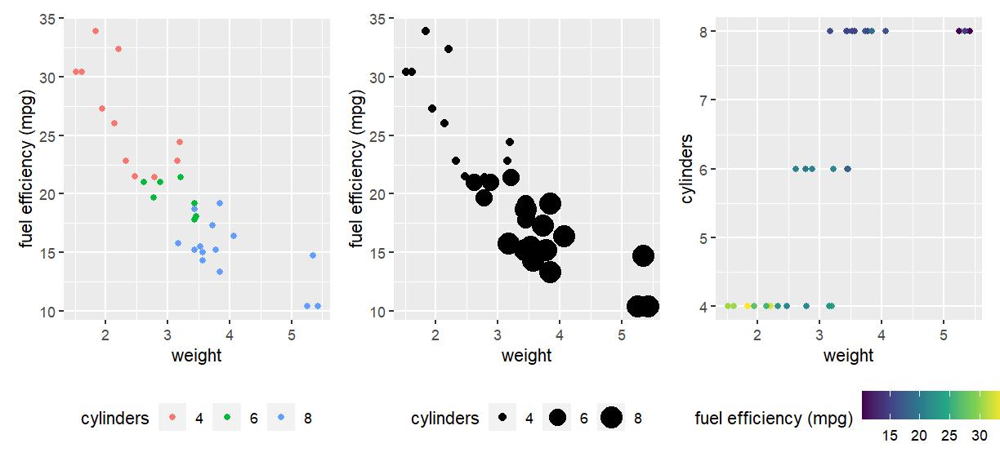
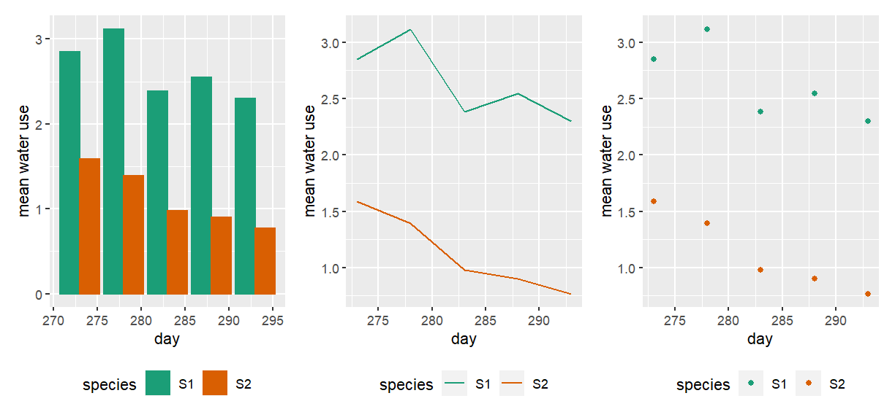
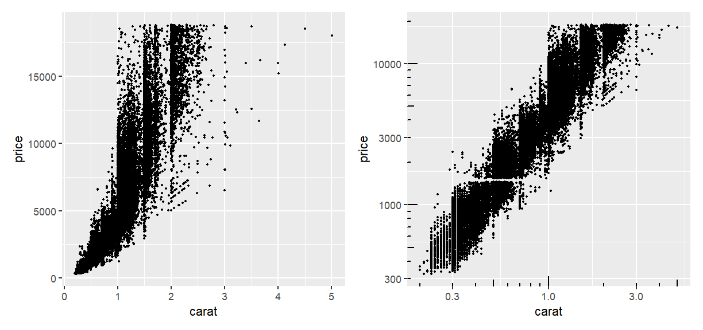
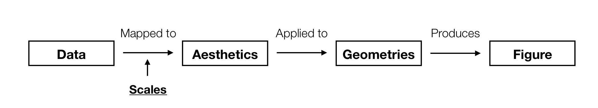
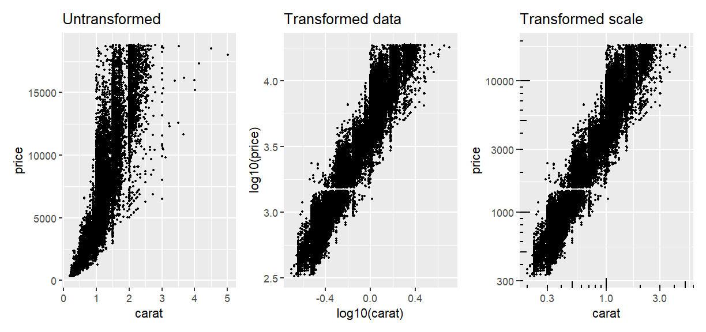
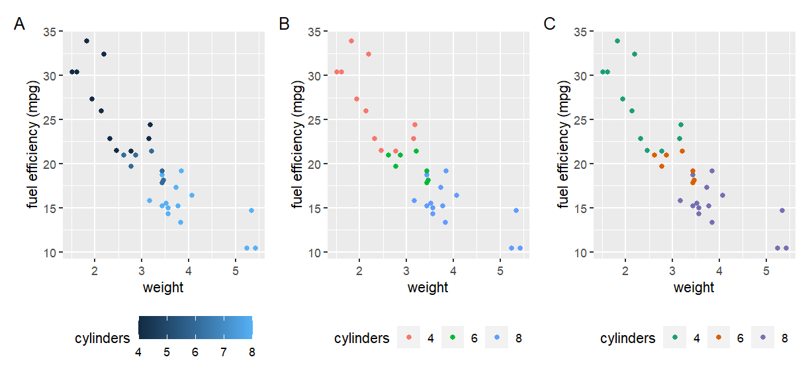
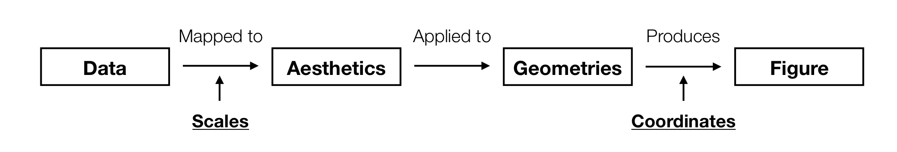
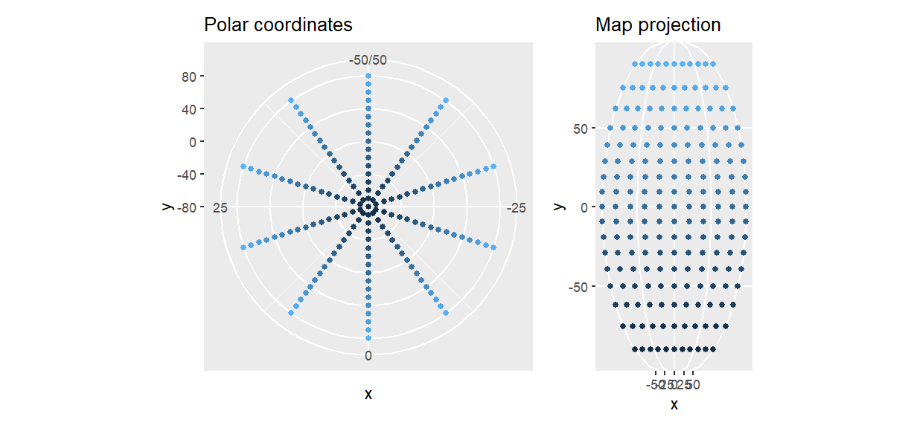
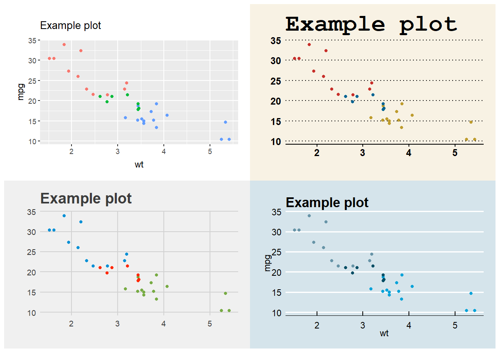
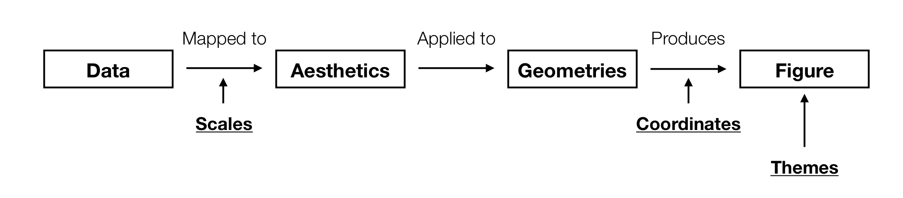

---
# Please do not edit this file directly; it is auto generated.
# Instead, please edit 01-visualisation.md in _episodes_rmd/
title: Introduction to Visualisation
teaching: 120
exercises: 120
questions:
- "What are the basic building blocks of visualisation"
objectives:
- "To be able to identify the links between a data visualisation and the underlying data structure"
- "To recognise the common visual features of a visualisation"
keypoints:
- "Visualisation is valuable"
- "There are common elements that link data to visual properties"
- "By mapping data attributes to visual attributes clearer visualisation is possible"
source: Rmd
---

## Why visualisation?

We have spent a lot of time learning about manipulating and exploring data. What sort of information
can we learn like that?

Let's meet some datasets:

~~~
# A tibble: 1,846 x 3
   dataset     x     y
     <dbl> <dbl> <dbl>
 1       4  55.4  97.2
 2       4  51.5  96.0
 3       4  46.2  94.5
 4       4  42.8  91.4
 5       4  40.8  88.3
 6       4  38.7  84.9
 7       4  35.6  79.9
 8       4  33.1  77.6
 9       4  29.0  74.5
10       4  26.2  71.4
# … with 1,836 more rows
~~~
{: .output}

Get an idea of their overall structure:

~~~
summary(data)
~~~
{: .language-r}

~~~
    dataset         x               y           
 Min.   : 1   Min.   :15.56   Min.   : 0.01512  
 1st Qu.: 4   1st Qu.:41.07   1st Qu.:22.56107  
 Median : 7   Median :52.59   Median :47.59445  
 Mean   : 7   Mean   :54.27   Mean   :47.83510  
 3rd Qu.:10   3rd Qu.:67.28   3rd Qu.:71.81078  
 Max.   :13   Max.   :98.29   Max.   :99.69468  
~~~
{: .output}

And some summary statistics for each dataset:

~~~
data %>% 
  group_by(dataset) %>% 
  summarise(
    mean_x = mean(x),
    mean_y = mean(y),
    sd_x = sd(x),
    sd_y = sd(y),
    correlation = cor(x,y)
  )
~~~
{: .language-r}

~~~
# A tibble: 13 x 6
   dataset mean_x mean_y  sd_x  sd_y correlation
     <dbl>  <dbl>  <dbl> <dbl> <dbl>       <dbl>
 1       1   54.3   47.8  16.8  26.9     -0.0641
 2       2   54.3   47.8  16.8  26.9     -0.0686
 3       3   54.3   47.8  16.8  26.9     -0.0683
 4       4   54.3   47.8  16.8  26.9     -0.0645
 5       5   54.3   47.8  16.8  26.9     -0.0603
 6       6   54.3   47.8  16.8  26.9     -0.0617
 7       7   54.3   47.8  16.8  26.9     -0.0685
 8       8   54.3   47.8  16.8  26.9     -0.0690
 9       9   54.3   47.8  16.8  26.9     -0.0686
10      10   54.3   47.8  16.8  26.9     -0.0630
11      11   54.3   47.8  16.8  26.9     -0.0694
12      12   54.3   47.8  16.8  26.9     -0.0666
13      13   54.3   47.8  16.8  26.9     -0.0656
~~~
{: .output}

> ## Challenge 1
> What can we say about these datasets just from looking at their summaries?
{:.challenge}

Let's try plotting one of them to see if we can spot anything new:

And it immediately becomes apparent what all those numbers **mean**

The other data sets we looked at are known as [the datasaurus dozen](https://www.autodeskresearch.com/publications/samestats). A group of 12 two-dimensional datasets that have identical:

* mean in both dimensions
* sd in both dimensions
* correlation between x and y

**But...**

> ## Discussion - What is a data visualisation? 
> 
> What is the difference between panel E and the other panels in the following figure?
> 
> {:class="fig-responsive" style="max-width:60%"}
{: .discussion}

## The roles of data visualisation 

In general there are two purposes behind data visualisations:

* As a discovery tool, to explore a dataset
* As a storytelling tool, to highlight features of a dataset

In both cases, a successful visualisation will illuminate and aid understanding, 
not confuse or obscure.

> ## Discussion - What makes an effective data visualisation?
>
> The figure below is from an [Axios article](https://www.axios.com/the-state-of-the-space-race-in-1-chart-1516917901-0bf90c42-25c6-4c98-a29f-d000e43e342a.html)
> about satellite launches.
> {:class="fig-responsive" style="max-width:70%"}
> 
> How effective is this visualisation at conveying the story of the dataset, and what features do 
> you feel contribute to that success?
{: .discussion}

## Talking about visualisations

Our goal today will be to learn how to **describe** visualisations and their connections to data.
We will build up a consistent vocabulary around visualisations that can be used to describe and create
complex visualisations out of a series of simple tools.

The big concept of the day is any plot can be constructed by mapping variables in your **data** to 
visual properties (**aesthetics**) which are then applied to the physical marks (**geometries**) chosen
to represent the data

#### Process outline

> ## New terms
> **Aesthetic:**
> 
> A visual property of the elements in a figure. Colour, size, and shape are all examples of 
> aesthetics that affect the way your figure is displayed.
>
>
> **Geometry:**
>
> The physical representation of your data. Points, lines, and bars are examples of geometries
> that could be used to illustrate the data in a figure.
{:.callout}

This will probably be a very big change in how you think about figures, let's try it on a few examples.

## Straight to a classic

> ## Challenge
>
> List the data elements contributing to this plot?
>
> **Hint:** One way to answer this is to ask yourself what the column names in the underlying 
> data frame might be.
>
> 
> What are some of the visual properties (aesthetics) used to convey this information?
>
>
> Which aesthetics are linked with which data variables?
> > ## Solution
> > The major variable/aethetic mappings are:
> > 
> > **Data Variable** | **Visual Component**
> > Longitude | x Axis
> > Latitude | y Axis
> > Number of troops | Line width
> > Direction of travel | Line colour
> > Temperature | y Axis (bottom chart)
> > Date | Text 
> >
>{: .solution}
{: .challenge}

Part of the reason this is a classic example of data visualisation is because of how information 
dense the image is and how clearly it conveys different elements of the data. Let's try the same 
approach with a more recent figure.

> ## A modern example?
> 
> {:class="fig-responsive" style="max-width:60%"}
> 
> List the data elements and visual aesthetics of the above figure. 
> 
> How they are linked together?
> > ## Solution
> > 
> > **Data Variable** | **Visual Component**
> > :---------|:-----------
> > No. landraces (l) | x Axis
> > No. gametes per landrace (g) | y Axis
> > r^2 decay distance | z Axis
> > r^2 decay distance | Bar colour
> >
> {: .solution}
{: .challenge}

Working on a single figure at a time doesn't give a good idea of how *changes* to the aesthetics or
geometries can affect a figure. Changing either of these components can hide or reveal information, 
and can sometimes completely change the story your figure is telling.

Consider the following set:

#### Changing aesthetics 

> ## Challenge
> 
> List the data elements, visual aesthetics, and geometries of the above figure to convince yourself
> that the only changes are in the **mappings** of the data to aesthetics. 
>
> > ## Solution
> > Left figure:
> >
> > **Data Variable** | **Aesthetic**
> > :---------|:-----------
> > Weight | x Axis
> > Fuel efficiency | y Axis
> > No. of cylinders | Colour
> >
> > Middle Figure:
> >
> > **Data Variable** | **Aesthetic**
> > :---------|:-----------
> > Weight | x Axis
> > Fuel efficiency | y Axis
> > No. of cylinders | Size
> >
> > Right figure:
> >
> > **Data Variable** | **Aesthetic**
> > :---------|:-----------
> > Weight | x Axis
> > No. of cylinders | y Asis
> > Fuel efficiency | Colour
> >
> > Each of these figures uses a **point** geometry
>{:.solution}
{:.challenge}

#### Changing geometries

> ## Challenge
> 
> Compare the three plots above
>
> - How are the data elements linked to the visual elements?
> - What is the difference between the three?
> - Do any of them tell a story more clearly?
>
> > ## Solution
> > All figures have the same aesthetic mapping:
> >
> > **Data Variable** | **Aesthetic**
> > :---------|:-----------
> > Day | x Axis
> > Mean water use | y Axis
> > Species | Colour
> >
> > But each of them uses a different geometry to represent this data. Bars, lines, and points from
> > left to right.
>{:.solution}
{:.challenge}

While the links between data, aesthetics, and geometries describe the core features of a visualisation,
there are several other components that influence the final figure.

Consider the following pair of plots:

> ## Challenge 
> 
> Compare the two plots above
> - How are the data elements linked to the visual elements?
> - What term would you use to describe the difference between the two?
>
> > ## Solution
> > Each plot has exactly the same data, aesthetic mapping, and geometries.
> > The only difference is that the x and y axis in the right hand figure is **scaled** logarithmically.
> {:.solution}
{: .challenge}

So this new concept extends our previous understanding of the visualisation process by affecting exactly
how values of your data are assigned to values of the visual property.

> ## Challenge
> 
> Which of the following are aesthetics?
>
> 1. Colour, size, shape
> 2. X and Y axis
> 3. Colour, size, shape, geometry
> 4. Both (1) and (2)
>
>> ## Solution
>> The correct answer is 4. From a 'grammer of graphics' framework, the X and Y axes are visual 
>> elements just like colour, size, and shape. Geometry (e.g. lines, bars, points) is not - 
>> it affects how your aesthetic mappings are displayed, not what the aesthetics themselves are. 
> {: .solution}
{: .challenge}
 
## Scale 

> ## New term
> **Scale:**
> 
> Controls *how* data values get converted into their aesthetic values. For example, the scale of a
> colour aesthetic determines what colours the data points are assigned to.
{:.callout}

To demonstrate that scaling is affecting the mapping of data to aesthetics, consider the following 
example:

In one of these, the *data* is transformed before plotting. In the other, the data values are left 
unchanged and just the *scaling* as to how those data points are mapped to the x and y axis is altered.

Do you find each option easier or harder to interpret?

Scales apply to all visual properties, with colour being the easiest to observe differences:

In this example, the cylinder variable is mapped to three different colour scales. One continuous 
(**A**) in which the values of cylinder are mapped to a spectrum of dark to light blue. The other 
two are categorical (**B**, **C**) in which the unique values of cylinder are mapped to individual 
colour values. The specific colour values are determined by the scale and are different between the 
two plots.

The choice of scale for your visualisations will depend on your data. Are they continuous or 
categorical? Can they be mapped directly onto an appropriate scale, or would a transformed scale
better represent the data?

## Coordinates

As with scales controlling the conceptual mapping of data to a visual property, coordinates control 
the physical mapping of geometries to positions on a screen/page.

> ## New term
> **Coordinate system:**
> 
> Controls how the points, lines, bars etc. of a visualisation get placed in physical space. 
{:.callout}

The coordinate system you are most familiar with is the Cartesian coordinate system. This is the x/y
two dimensional plane that has been used in the examples so far. 

A simple modification we could make to this system is to enforce a condition on the coordinates that
our two dimensions have to be equal. In other words, a unit of length along the x axis is the same 
physical distance as a unit of length along the y axis:

In this example, you can see that on the right hand figure, the distance between -50 and 0 on the x axis
is exactly the sasme distance as between -50 and 0 on the y axis.

> ## Discussion
> Why might you choose to enforce this restriction on the coordinate system?
{: .discussion}

While this might seem like a small change, changing the coordinate system can have a drastic effect
on the presentation of your data and how it is interpreted.

~~~
Error in loadNamespace(name): there is no package called 'mapproj'
~~~
{: .error}

> ## Discussion
> The two plots above show exactly the same data as the grid previously. Do the changed coordinates
> change how you might interpret the data?
{: .discussion}

## Applying your visualisation vocabulary

By now you have developed a vocabulary that will let you talk consistently about figures. Time to try
it out on something you are familiar with.

> ## Challenge
> Select a figure you have produced, or one that you have seen and thought was very effective. 
>
> Describe the **data** they contain, how that data is mapped to the visual **aesthetics** and what
> **geometries** were chosen to represent the data. Did you have to consider the **scale** or
> **coordinate system** for the figure to get your deired point across?
>
> Find a partner and share your figure and description. Do your figures share any common features?
{: .challenge}

This process allows you to decsribe a figure even if you are not familiar with how to create it.

> ## Challenge - Advanced
> Consider the following visualisation from The Guardian showing the [change in voting patterns at
> the 2018 US elections](https://www.theguardian.com/us-news/ng-interactive/2018/nov/07/blue-wave-or-blue-ripple-a-visual-guide-to-the-democrats-gains):
> <iframe height="600" src="https://interactive.guim.co.uk/uploader/embed/2018/11/swing-zip/giv-3902uF0MQNdI60jh/" style="width: 100%; border: 1px;"></iframe>
>
> How would you describe this visualisation?
> 
> **Hint:** You will need to create a new type of geometry that we haven't discussed to describe 
> this. What might you call it and what aesthetics will it use?
{: .challenge}

## That special something
Until now, everything we have discussed has had some *functional* role in creating a figure. We have 
been talking about how to display our data with a visual representation that allows us to understand
the features of our data. There are a lot of other aspects to a plot that can affect the final look 
however.

> ## Challenge
> What changes between the following plots? What term would *you* use to describe these features?
> 
> 
{:.challenge}

These aspects to not change the data elements of a figure, but do have an impact on how the plot looks.
We will refer to these as the **theme** of a visualisation.

> ## New term
> **Theme:**
> 
> Any non-data element of a visualisation. Changing these can still have a dramatic effect on the 
> final presentation of the figure.. 
{:.callout}
