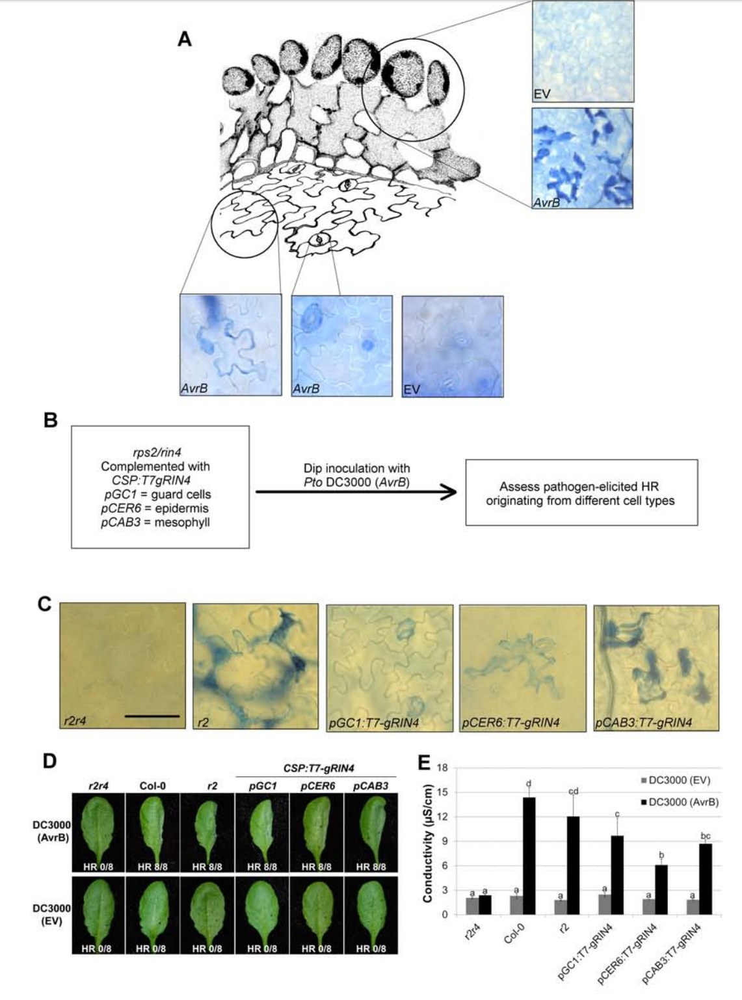
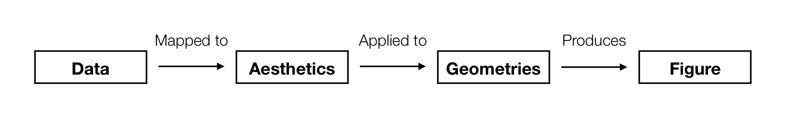

---
# Please do not edit this file directly; it is auto generated.
# Instead, please edit 01-visualisation.md in _episodes_rmd/
title: Introduction to Visualisation
teaching: 90
exercises: 90
questions:
- "What are the basic building blocks of visualisation"
objectives:
- "To be able to identify the links between a data visualisation and the underlying data structure"
- "To recognise the common visual features of a visualisation"
keypoints:
- "Visualisation is valuable"
- "There are common elements that link data to visual properties"
- "By mapping data attributes to visual attributes clearer visualisation is possible"
source: Rmd
---

## Why visualisation?

We have spent a lot of time learning about manipulating and exploring data. What sort of information
can we learn like that?

Let's meet some datasets:

~~~
# A tibble: 1,846 x 3
   dataset     x     y
     <dbl> <dbl> <dbl>
 1       4  55.4  97.2
 2       4  51.5  96.0
 3       4  46.2  94.5
 4       4  42.8  91.4
 5       4  40.8  88.3
 6       4  38.7  84.9
 7       4  35.6  79.9
 8       4  33.1  77.6
 9       4  29.0  74.5
10       4  26.2  71.4
# … with 1,836 more rows
~~~
{: .output}

Get an idea of their overall structure:

~~~
summary(data)
~~~
{: .language-r}

~~~
    dataset         x               y           
 Min.   : 1   Min.   :15.56   Min.   : 0.01512  
 1st Qu.: 4   1st Qu.:41.07   1st Qu.:22.56107  
 Median : 7   Median :52.59   Median :47.59445  
 Mean   : 7   Mean   :54.27   Mean   :47.83510  
 3rd Qu.:10   3rd Qu.:67.28   3rd Qu.:71.81078  
 Max.   :13   Max.   :98.29   Max.   :99.69468  
~~~
{: .output}

And some summary statistics for each dataset:

~~~
data %>% 
  group_by(dataset) %>% 
  summarise(
    mean_x = mean(x),
    mean_y = mean(y),
    sd_x = sd(x),
    sd_y = sd(y),
    correlation = cor(x,y)
  )
~~~
{: .language-r}

~~~
# A tibble: 13 x 6
   dataset mean_x mean_y  sd_x  sd_y correlation
     <dbl>  <dbl>  <dbl> <dbl> <dbl>       <dbl>
 1       1   54.3   47.8  16.8  26.9     -0.0641
 2       2   54.3   47.8  16.8  26.9     -0.0686
 3       3   54.3   47.8  16.8  26.9     -0.0683
 4       4   54.3   47.8  16.8  26.9     -0.0645
 5       5   54.3   47.8  16.8  26.9     -0.0603
 6       6   54.3   47.8  16.8  26.9     -0.0617
 7       7   54.3   47.8  16.8  26.9     -0.0685
 8       8   54.3   47.8  16.8  26.9     -0.0690
 9       9   54.3   47.8  16.8  26.9     -0.0686
10      10   54.3   47.8  16.8  26.9     -0.0630
11      11   54.3   47.8  16.8  26.9     -0.0694
12      12   54.3   47.8  16.8  26.9     -0.0666
13      13   54.3   47.8  16.8  26.9     -0.0656
~~~
{: .output}

> ## Challenge 1
> What can we say about these datasets just from looking at their summaries?
{:.challenge}

Let's try plotting one of them to see if we can spot anything new:

And it immediately becomes apparent what all those numbers **mean**

The other data sets we looked at are known as [the datasaurus dozen](https://www.autodeskresearch.com/publications/samestats). A group of 12 two-dimensional datasets that have identical:

* mean in both dimensions
* sd in both dimensions
* correlation between x and y

**But...**

## The roles of data visualisation 

In general there are two purposes behind data visualisations:

* As a discovery tool, to explore a dataset
* As a storytelling tool, to highlight features of a dataset

In both cases, a successful visualisation will illuminate and aid understanding, 
not confuse or obscure.

> ## Discussion - What is a data visualisation? 
> 
> What is the difference between panel E and the other panels in the following figure?
> 
> 
{: .discussion}

## Talking about visualisations

Our goal today will be to learn how to **describe** visualisations and their connections to data.
We will build up a consistent vocabulary around visualisations that can be used to describe and create
any visualisation you can imagine.

The big concept of the day is any plot can be constructed by mapping variables in your **data** to 
visual properties (**aesthetics**) which are then applied to the physical marks (**geometries**) chosen
to represent the data

> ## Definitions
> 
{:.callout}

This will probably be a very big change in how you think about figures, let's try it.

## Straight to a classic

> ## Challenge
>
> List the data elements contributing to this plot?
>
> **Hint:** One way to answer this is to ask yourself what the column names in the underlying 
> data frame might be.
>
> 
> What are some of the visual properties (aesthetics) used to convey this information?
>
>
> Which aesthetics are linked with which data variables?
> > ## Solution
> > The major variable/aethetic mappings are:
> > 
> > **Data Variable** | **Visual Component**
> > Longitude | x Axis
> > Latitude | y Axis
> > Number of troops | Line width
> > Direction of travel | Line colour
> > Temperature | y Axis (bottom chart)
> > Date | Text 
> >
>{: .solution}
{: .challenge}

Part of the reason this is a classic example of data visualisation is because of how information 
dense the image is and how clearly it conveys different elements of the data. Let's try the same 
approach with a more recent figure.

> ## A modern example?
> 
> {:class="fig-responsive" style="max-width:60%"}
> 
> List the data elements and visual aesthetics of the above figure. 
> 
> How they are linked together? What does this linking tell you about the figure? 
> > ## Solution
> > 
> > **Data Variable** | **Visual Component**
> > :---------|:-----------
> > No. landraces (l) | x Axis
> > No. gametes per landrace (g) | y Axis
> > r^2 decay distance | z Axis
> > r^2 decay distance | Bar colour
> >
> > This figure has a **redundant** mapping with the same data variable being mapped to 
> > multiple aesthetics. Are both of them necessary for the purpose of the figure?
> {: .solution}
{: .challenge}

## Another example

> ## Challenge 
> 
> Compare the two plots above
> - How are the data elements linked to the visual elements?
> - What is the difference between the two?
{: .callout}

> ## Challenge
> 
> Compare the two plots above
> How are the data elements linked to the visual elements?
> What is the difference between the two?
> Do either of them tell a story more clearly?
{: .callout}
