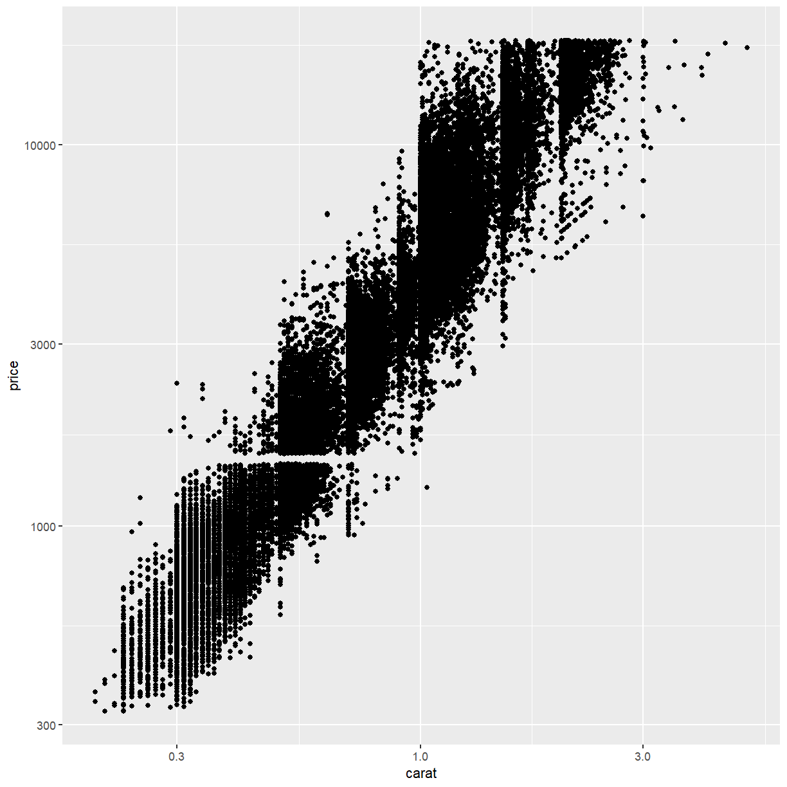

---
# Please do not edit this file directly; it is auto generated.
# Instead, please edit 01-visualisation.md in _episodes_rmd/
title: Introduction to Visualisation
teaching: 60
exercises: 60
questions:
- "What are the basic building blocks of visualisation"
objectives:
- "To be able to identify the links between a data visualisation and the underlying data structure"
- "To recognise the common visual features of a visualisation"
- "To be able to restrict visual elements to only those that are necessary"
keypoints:
- "Visualisation is valuable"
- "There are common elements that link data to visual properties"
- "By mapping data attributes to visual attributes clearer visualisation is possible"
source: Rmd
---

## Why visualisation?

Let's meet a dataset:

~~~
# A tibble: 142 x 3
   dataset     x     y
     <dbl> <dbl> <dbl>
 1       4  55.4  97.2
 2       4  51.5  96.0
 3       4  46.2  94.5
 4       4  42.8  91.4
 5       4  40.8  88.3
 6       4  38.7  84.9
 7       4  35.6  79.9
 8       4  33.1  77.6
 9       4  29.0  74.5
10       4  26.2  71.4
# … with 132 more rows
~~~
{: .output}

Let's get an idea of its structure:

~~~
summary(data)
~~~
{: .language-r}

~~~
    dataset        x               y         
 Min.   :4   Min.   :22.31   Min.   : 2.949  
 1st Qu.:4   1st Qu.:44.10   1st Qu.:25.288  
 Median :4   Median :53.33   Median :46.026  
 Mean   :4   Mean   :54.26   Mean   :47.832  
 3rd Qu.:4   3rd Qu.:64.74   3rd Qu.:68.526  
 Max.   :4   Max.   :98.21   Max.   :99.487  
~~~
{: .output}

One little scatterplot:

Some more examples of why data visualisation is so valuable:

[The datasaur dozen](https://www.autodeskresearch.com/publications/samestats]. ) group of 12 two-dimensional datasets that have identical:

* mean in both dimensions
* sd in both dimensions
* correlation between x and y

**But...**

## The roles of data visualisation 

In general there are two purposes behind data visualisations:

* As a discovery tool, to explore a dataset
* As a storytelling tool, to highlight features of a dataset
In both cases, successful visualisation will 
illuminate and aid understanding, 
not confuse or obscure.

> ## Discussion - What is a data visualisation? 
> 
> What is the difference between panel E and the other panels in the following figure?
> 
> 
{: .discussion}

## Straight to a classic

> ## Challenge
>
> What are the data elements contributing to this plot?
>
> How are they each visually represented?
> 
> > ## Solution
> > Data Variable | Visual Component
> > --------------|----------------
> > Longitude | x Axis
> > Latitude | y Axis
> > Number of troops | Line width
> > Direction of travel | Line colour
> > Temperature | y Axis (bottom chart)
> > Date | Text 
>{: .solution}
{: .challenge}
> ## A modern example?
> 
> 
> 
> How are the data elements linked to visual elements?
{: .callout}
## Another example

> ## Challenge 
> 
> Compare the two plots above
> - How are the data elements linked to the visual elements?
> - What is the difference between the two?
{: .callout}

> ## Challenge
> 
> Compare the two plots above
> How are the data elements linked to the visual elements?
> What is the difference between the two?
> Do either of them tell a story more clearly?
{: .callout}
