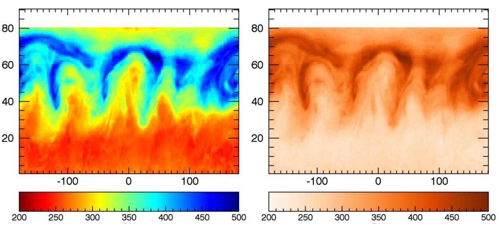
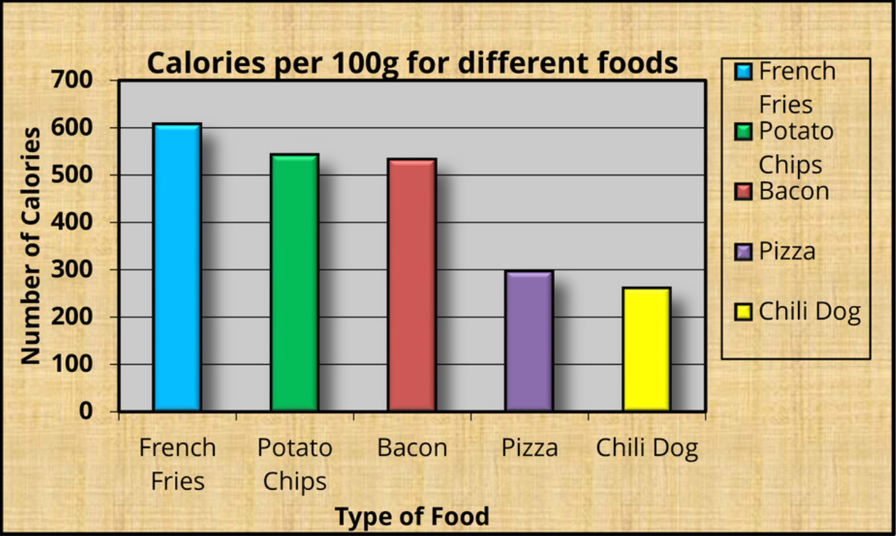
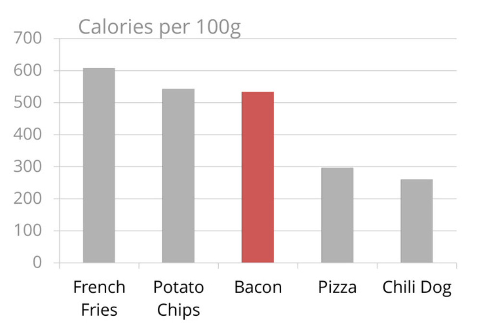
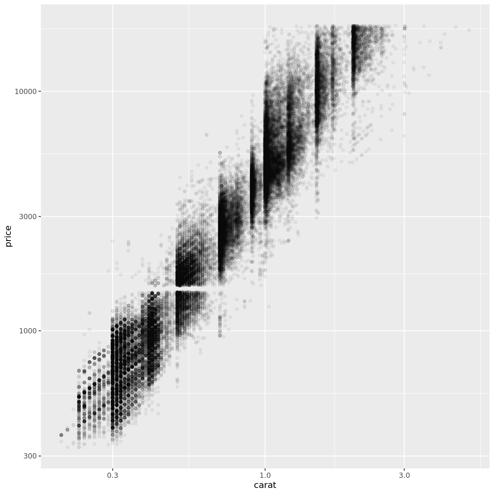
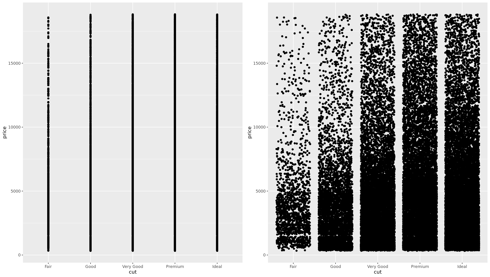
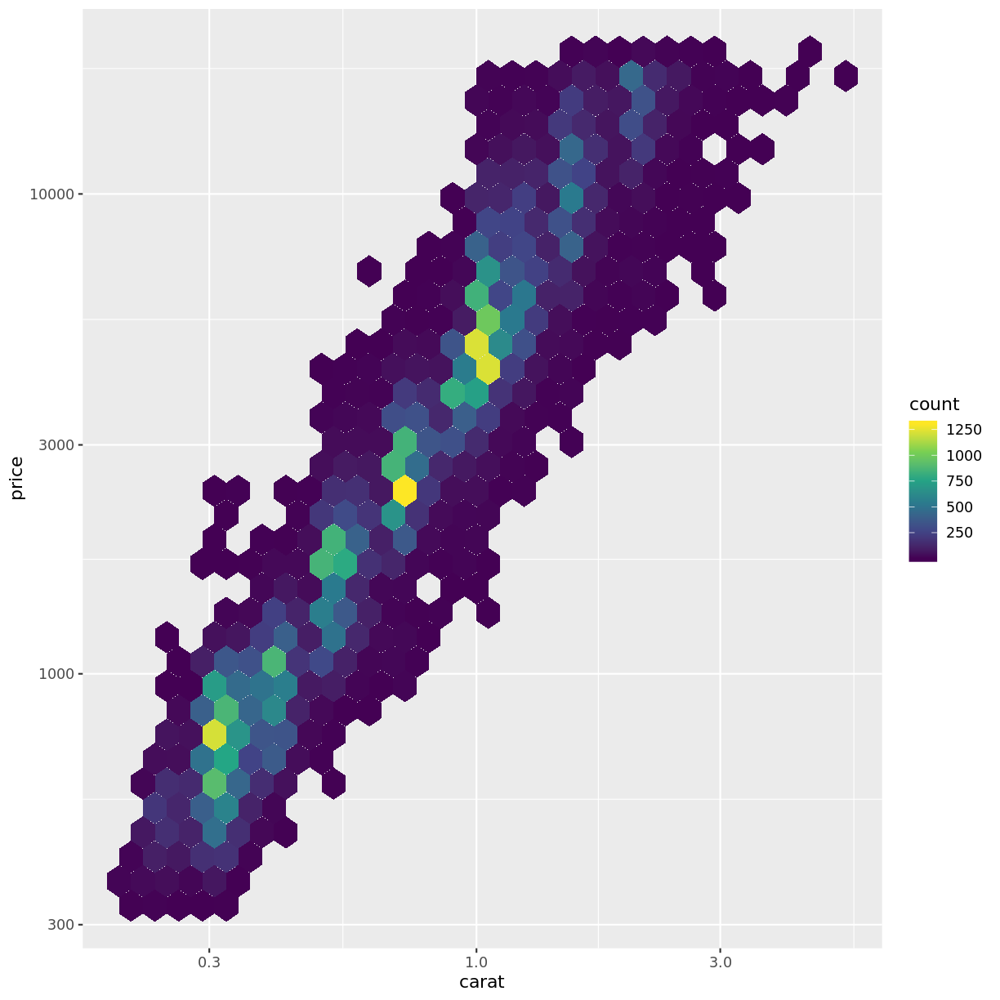

---
# Please do not edit this file directly; it is auto generated.
# Instead, please edit 02-considerations.md in _episodes_rmd/
title: Considerations for improving visualisations 
teaching: 30
exercises: 30 
questions:
- "What are some common errors in visualisation?"
- "How can these be overcome"
objectives:
- "To be able to restrict visual elements to only those that are necessary"
- "To avoid common visualisation errors"
keypoints:
- "Don't use rainbow colour scales!"
- "Colour scales must not confuse the data or add artefacts"
- "Visual components that do not aid understanding should be removed"
- "Overplotting reduces the clarity of communication through visualisation"
source: Rmd
---

## Colour

### Friends don't let friends use rainbow colour scales

Rainbow colour scales are very, very common in scientific literature. They are a very natural way to represent quantitative data - the wavelength of the colour changes in a linear relationship with the data.

The problem is that our eyes don't perceive those changes in colour in a uniform way.

This can have serious real world consequences for scientific data visualisation.

The plot on the left was published in a [paper in 2006](https://www.atmos-chem-phys.net/6/5183/2006/) using a rainbow colour scale, and reproduced in a sequential colour scale on the right (from [https://www.atmos-chem-phys.net/6/5183/2006/](https://www.atmos-chem-phys.net/6/5183/2006/).

In the versions below, the blue line represent a false boundary that was identified in the data, entirely due to the way our eyes perceive colour - it isn't actually present in the data!

It's not continuous rainbow colour scales that have this problem. Once you start looking for them, you will see them everywhere.

[One of the worst offenders.](http://bom.gov.au/products/IDR403.loop.shtml)

### Other colour considerations

Aside from the evils of rainbow colour scales, it is also important to consider issues such as:
- colour blindness
- reproduction of figures in monotone (black and white)
- using too many colours for them to be distinguished from each other

An excellent resource for many considerations to do with colour in visualisation is [ColorBrewer](http://colorbrewer2.org/), which provides a range of scales for different applications.

## Ink to information ratio

Compare the amount of ink used with the amount of information communicated. A high ink:information can indicate a plot that hasn't been thought through, and is often distracting or confusing. 

These plots often contain 'chart junk' (Edward Tufte).
  

> ## Challenge 
> 
> Compare the above figure. 
> - Which elements are removed in the second version?
> - Which elements could still be removed? What is their purpose?
{: .challenge}

## Some common errors in visualisation
### Overplotting

We're about to learn how to use R to make visualisations. Once you have the ability to quickly turn large datasets into figures, it can be easy to run into the problem of **overplotting** when there are too many data points...

> ## Discussion 
> 
> - What are some possible solutions to overplotting?
{: .discussion}

### Transparency

### Binning

### Jittering

