---
# Please do not edit this file directly; it is auto generated.
# Instead, please edit 03-plot-ggplot2.md in _episodes_rmd/
title: Creating Graphics with ggplot2
teaching: 120
exercises: 120
questions:
- "How can I create graphics in R?"
objectives:
- "To be able to use ggplot2 to generate publication quality graphics."
- "To apply geometry, aesthetic, and statisics layers to a ggplot plot."
- "To manipulate the aesthetics of a plot usng different colors, shapes, and lines."
- "To improve data visualization through transforming scales and paneling by group."
keypoints:
- "Use `ggplot2` to create plots."
- "Think about graphics in layers: aesthetics, geometry, statistics, scale transformation, and grouping."
source: Rmd
---

Plotting our data is one of the best ways to
quickly explore it and the various relationships
between variables.

There are three main plotting systems in R,
the [base plotting system][base], the [lattice][lattice]
package, and the [ggplot2][ggplot2] package.

[base]: http://www.statmethods.net/graphs/index.html
[lattice]: http://www.statmethods.net/advgraphs/trellis.html
[ggplot2]: http://www.statmethods.net/advgraphs/ggplot2.html

Today we'll be learning about the ggplot2 package, because
it is the most effective for creating publication quality
graphics.

ggplot2 is built on the grammar of graphics, the idea that any plot can be
expressed from the same set of components: a **data** set, a
**coordinate system**, and a set of **geoms**--the visual representation of data
points.

This is exactly the model that we were exploring earlier.

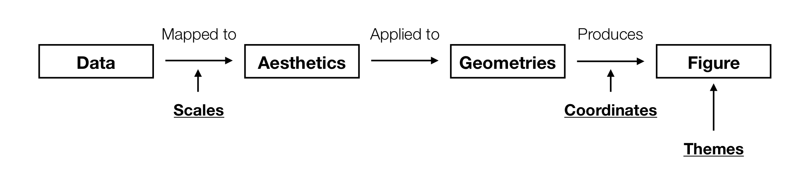

Beyond these ideas discussed yesterday, the key to understanding ggplot2 is thinking about a figure in layers.
This idea may be familiar to you if you have used image editing programs like Photoshop, Illustrator, or
Inkscape. 

Before we begin learning how to implement these steps in code however, let's refresh our memory on
the process of describing a figure.

<iframe width="560" height="315" src="https://www.youtube.com/embed/Z8t4k0Q8e8Y" frameborder="0" allow="accelerometer; autoplay; encrypted-media; gyroscope; picture-in-picture" allowfullscreen></iframe>

> ## Challenge 1
> Watch the video above from the BBC in which Hans Rosling walks us through a data visualisation.
> Since we haven't discussed anything about animation yet, let's just focus on a single frame.
>
> 
> 
> - What are the data variables being displayed in this plot?
> - What aesthetics are they mapped to?
> - What geometries are they represented with?
> - What are the scales and coordinate system used?
>
> > ## Solution
> >
> > **Data Variable** | **Aesthetic**
> > :---------|:-----------
> > Income per person | x Axis
> > Life expectancy | y Axis
> > World region | Colour
> > Population | Size
> >
> > The data is shown using points, with a linear scale for life expectancy, a logarithmic scale for
> > income per person, and a categorical scale for world region. The standard coordinate system for
> > this sort of figure is the Cartesian coordinate system.
>{:.solution}
{:.challenge}

If this data seems familiar to you, it's because you have already spent a great deal of time with it.
Before making some plots, let's get our brains back into R mode:

> ## Challenge 2
>
> Make a new project for this lesson and initialise a git repository.
>
> Add the [gapminder data from this link](../data/gapminder_data.csv) (or from your previous R lesson directory) to a `data` folder in your new repository.
>
> Commit the data to the git repository.
>
> Open a new script and use `read_csv` to read in the gapminder data and assign it to a variable called `gapminder`.
> (Hint: `read_csv` can be accessed through the `tidyverse` package).
>
> Because our example figure uses only the data from 1977, create a new data frame called `gapminder_1977` 
> and assign it the data just from 1977 using the `filter()` function.
>
> Commit the script to the repository
{: .challenge}

~~~
library(tidyverse)

gapminder <- read_csv("../data/gapminder_data.csv")
gapminder_1977 <- filter(gapminder, year == 1977)
~~~
{: .language-r}

We'll work with the gapminder dataset throughout the day to make several plots to explore the data 
and learn how to construct a plot. Without getting too concerned about the details of specific commands
for now, let's see an example of how to turn our description of the gapminder plot into code.

## ggplot

The first important function to learn is `ggplot()`. This function lets R know that we're creating a
new plot. Any visualisation process starts with the data you are displaying, so we will provide
the gapminder data as the `data` argument of the function.

~~~
ggplot(data = gapminder_1977)
~~~
{: .language-r}

Obviously nothing interesting is shown yet, because we have not told R what to *do* with the data yet.

The next step in our process is mapping our data variables to particular aesthetics in the final plot.
For this, we will use the `mapping` argument to `ggplot()`. For this argument, we will use the `aes()`
function, in which we link an aesthetic name with a variable in our data (using the column name in 
the data frame).

~~~
ggplot(
  data = gapminder_1977, 
  mapping = aes(x = gdpPercap, y = lifeExp, colour = continent, size = pop)
)
~~~
{: .language-r}

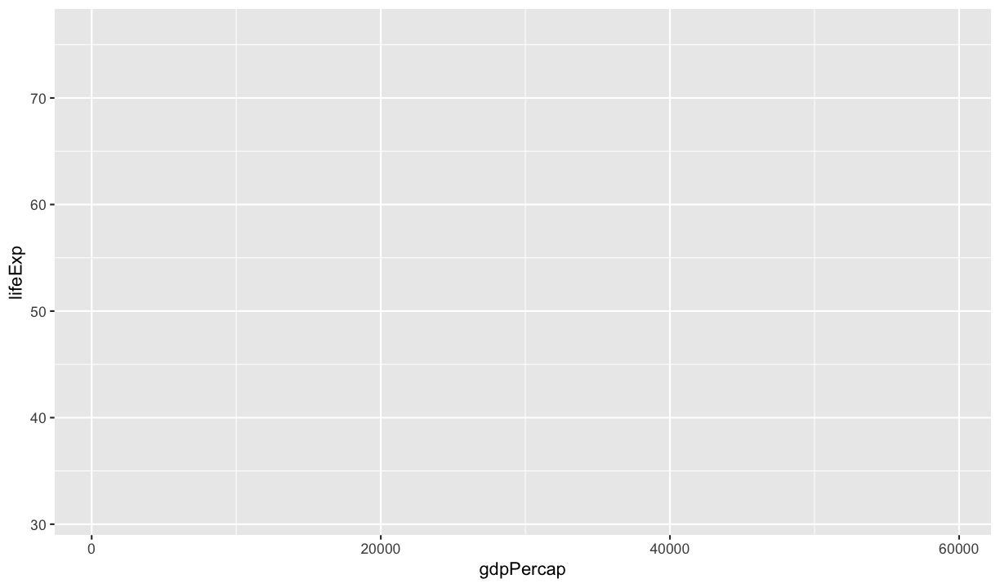

In this `aes()` function, we are telling `ggplot` that it should map the data in the `gdpPercap` column
to the position on the x axis, the data in the `lifeExp` column to the position on the y axis, the data 
in the `continent` column to the colour of plot elements, and the data in the `pop` column to the 
size of the plot elements. 

> ## Challenge 3
> What has changed in this plot and why?
>
> > ## Solution
> > We now have some axes, but not much else. Because we have provided some aesthetics to work with,
> > `ggplot()` fits some default scales, coordinates and themes to our data. This effectively sets 
> > up a plotting environment for us to work with.
>{:.solution}
{:.challenge}

To get something a bit more interesting happening, we need to provide a geometry to which these 
aesthetics can be applied. In this case, we want a point geometry, which can be added to the plot
using the `geom_point()` function. Notice in the code below that we are *adding* the geom to
the base plot above. This shows the layered nature of building a plot. We will continue adding 
additional layers later that will add to how the plot is displayed.

~~~
ggplot(
  data = gapminder_1977, 
  mapping = aes(x = gdpPercap, y = lifeExp, colour = continent, size = pop)
) +
  geom_point()
~~~
{: .language-r}

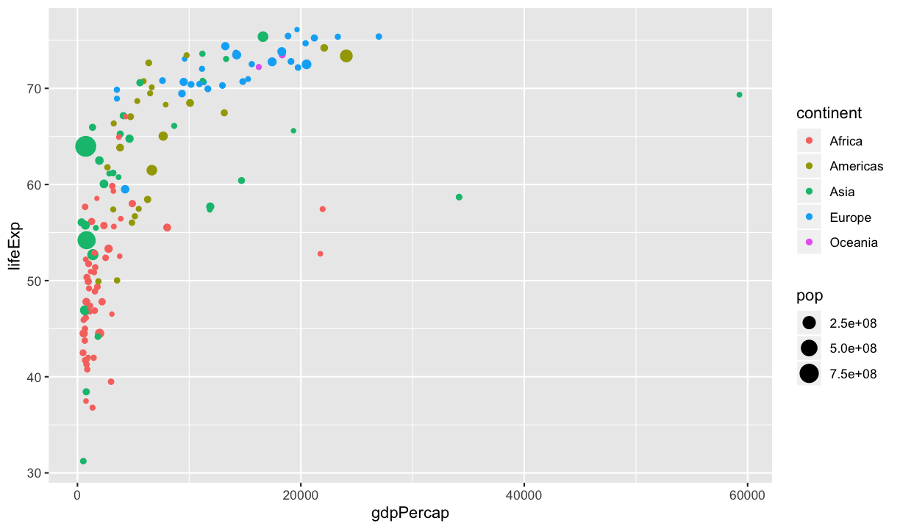

Now we are getting somewhere. This is the first thing we have produced that might actually be called
a 'plot'. This basic structure: 

~~~~~~
ggplot(<DATA>, <AESTHETIC MAPPING>) + <GEOMETRY FUNCTION>
~~~~~~
{:.language-r}

is all you need to get started.

> ## Discussion
> What is still missing from the figure and not provided by the default settings?
{:.discussion}

The final step in creating something that looks closer to our example image is to add a logarithmic
scale to the x axis. Like adding the point geometry layer, we will add a scale to the plot using the `+`.

~~~
ggplot(
  data = gapminder_1977, 
  mapping = aes(x = gdpPercap, y = lifeExp, colour = continent, size = pop)
) +
  geom_point() +
  scale_x_log10()
~~~
{: .language-r}

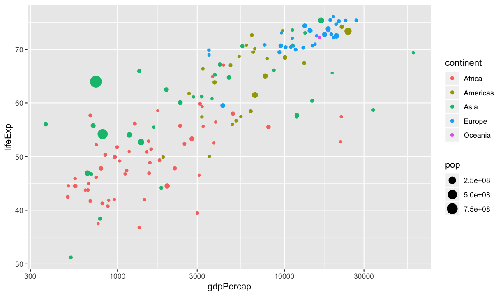

And so we have created something pretty close to the image from the video with a few short lines of
code that describe the process of building the plot. We provided some **data**, and mapped the data
values onto **aesthetic** properties (using a log **scale** to adjust this mapping for one variable),
then applied these aesthetics to a point **geometry** to produce a scatter plot.

Once you are comfortable with the core concept, creating any plot you want is a matter of working 
through the same process. 

> ## Challenge 4
> There are six variables in the `gapminder_1977` data frame, `country`, `year`, `pop`, `continent`,
> `lifeExp`, and `gdpPercap`. Although as `year` contains just the value `1977` it is not that informative.
> 
> Using the template:
> ~~~~
> ggplot(gapminder_1977, aes(x = <VAR1>, y = <VAR2>, colour = <VAR3>)) + geom_point()
> ~~~~
> {:.language-r}
> experiment with substituting different combinations of the data variables into the three positions.
> 
> How do the default parameters treat the different variables?
{:.challenge}

## Digging Deeper

### Aesthetics

To start looking a little more closely into the details of how this all works, we will begin with 
the aesthetic mappings. In our example, this mapping was defined in the `ggplot()` call. In this situation,
the mapping is a **global** one -- it will be applied to every geom added to the figure.

The mappings are also able to be defined in each geom function. In this case, the mapping is specific
to that geom and is not applied to other elements of the figure.

With only a single geom in the figure, these two forms will produce identical plots:
~~~~~~
ggplot(
  data = gapminder_1977, 
  mapping = aes(x = gdpPercap, y = lifeExp, colour = continent, size = pop)
) +
  geom_point()

#######
  
ggplot(
  data = gapminder_1977
) +
  geom_point( mapping = aes(x = gdpPercap, y = lifeExp, colour = continent, size = pop) )
~~~~~~
{:.language-r}

This will be useful as we start adding multiple geoms and want to change the aesthetic mappings for 
each layer. Or in situations where we may be using multiple geoms that don't all understand the same
aesthetics.

> ## Challenge 5
> The aesthetics that can be mapped to a geom can be found in it's help file under the heading **Aesthetics**.
> Review the help file for the `geom_point()` we have been using and list the aesthetics it can 
> understand. What do you think they do?
> > ## Solution
> > - x
> > - y
> > - alpha
> > - colour
> > - fill
> > - group
> > - shape
> > - size
> > - stroke
> {:.solution}
{:.challenge}

#### Mapping vs Setting
When *mapping* aesthetics (inside an `aes()` function), the value the aesthetic takes is determined 
by the data. We can instead *set* the value of an aesthetic directly by assigning it outside of the
`aes()` function.

~~~
ggplot(gapminder_1977, aes(x = gdpPercap, y = lifeExp)) +
  geom_point(colour = "blue", size = 5) 
~~~
{: .language-r}

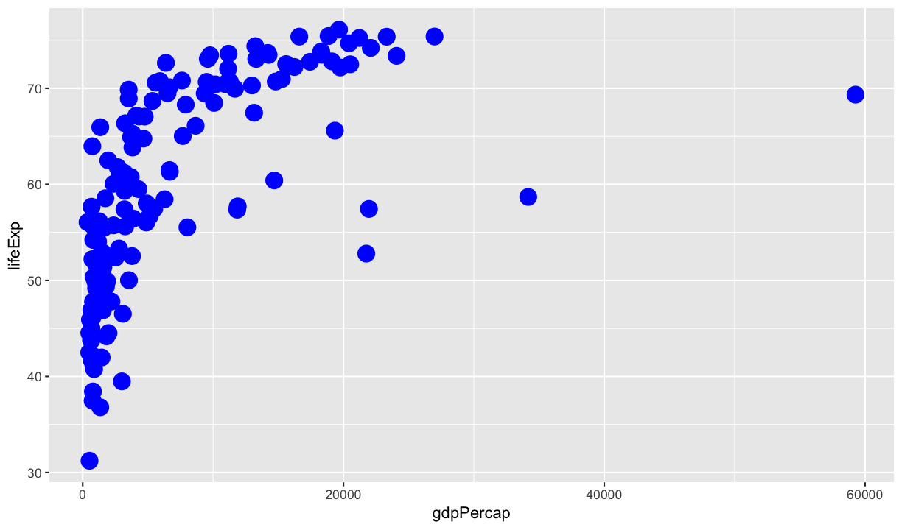

> ## Challenge 6
> Using the code from our example gapminder plot:
> ~~~~~
>  ggplot(
>  data = gapminder_1977, 
>  mapping = aes(x = gdpPercap, y = lifeExp, colour = continent, size = pop)
>) +
>  geom_point() +
>  scale_x_log10()
> ~~~~~
> {:.language-r}
> try *setting* some aesthetics in the `geom_point()` function (See solution to Challenge 5 for a 
> list of possible aesthetics). What happens if you set an aesthetic that has already been mapped 
> to a data variable?
> > ## Solution
> > *Setting* an aesthetic overrides the *mapping*.
> {:.solution}
{:.challenge}

### Layers
We've talked about these steps as adding layers to a plot, but so far we haven't really taken advantage
of that. By adding multiple geoms we can build up to creating quite complex figures. To demonstrate 
this, we are going to go back to working with the complete `gapminder` data frame.

> ## Challenge 7
>
> Create a scatterplot using `gapminder` that shows how life expectancy has changed over time:
>
> **Hint:** the gapminder dataset has a column called `year`, which should appear
> on the x-axis.
>
> > ## Solution
> >
> > 
> > ~~~
> > ggplot(data = gapminder, mapping = aes(x = year, y = lifeExp)) + geom_point()
> > ~~~
> > {: .language-r}
> > 
> > 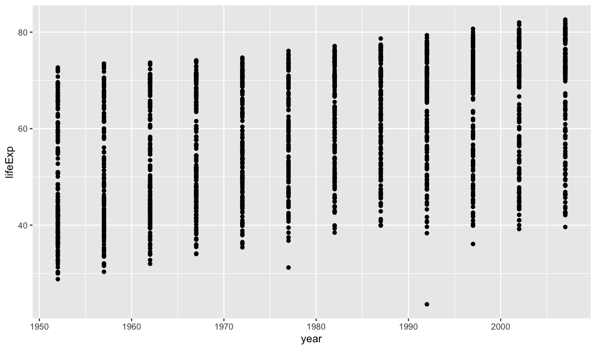
> >
> {: .solution}
{: .challenge}

Using a scatterplot probably isn't the best for visualising change over time however.
Instead, let's tell `ggplot` to visualize the data as a line plot:

~~~
ggplot(data = gapminder, aes(x = year, y = lifeExp, group = country, color = continent)) +
  geom_line()
~~~
{: .language-r}

Instead of adding a `geom_point` layer, we've added a `geom_line` layer. We've also
added the **group** *aesthetic*, which tells `ggplot` that each country should get it's own line.

But what if we want to visualise both lines and points on the plot? We can
simply add another layer to the plot:

~~~
ggplot(data = gapminder, aes(x = year, y = lifeExp, group = country, color = continent)) +
  geom_line() + 
  geom_point()
~~~
{: .language-r}

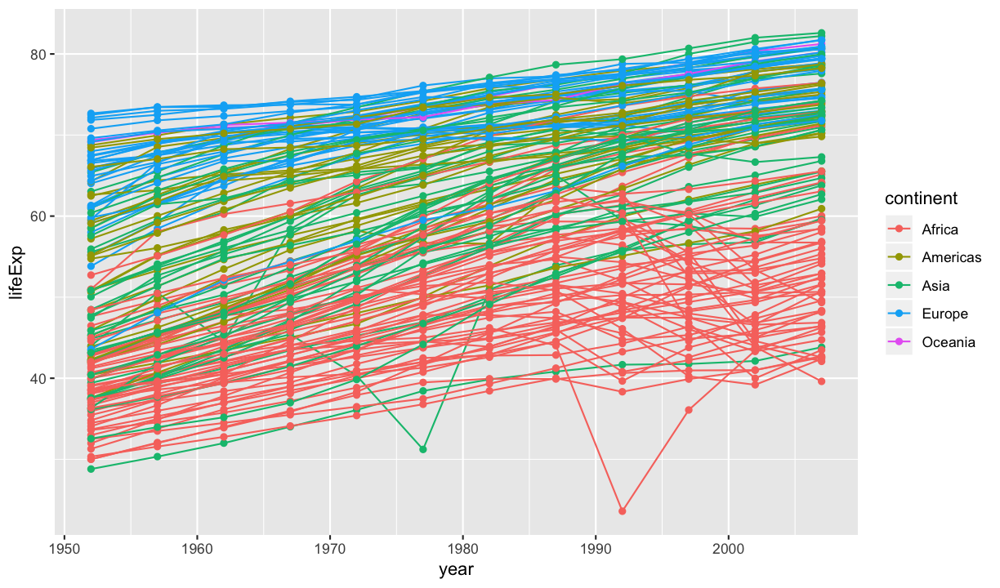

It's important to note that each layer is drawn on top of the previous layer. So in this example, the
lines are drawn first, and then the points are drawn *on top of* the lines. 

> ## Challenge 8
> Modify the code from the example above so that only the lines are coloured by continent and the points
> remain black.
> 
> Then switch the order of the `geom_line()` and `geom_point()` layers. What do you notice?
> > ## Solution
> > This could be done either by moving the mapping of colour to continent to be within the `geom_line()`
> > function:
> > 
> > ~~~
> > ggplot(data = gapminder, aes(x = year, y = lifeExp, group = country)) +
> >   geom_line(mapping = aes(colour = continent)) + 
> >   geom_point()
> > ~~~
> > {: .language-r}
> > 
> > 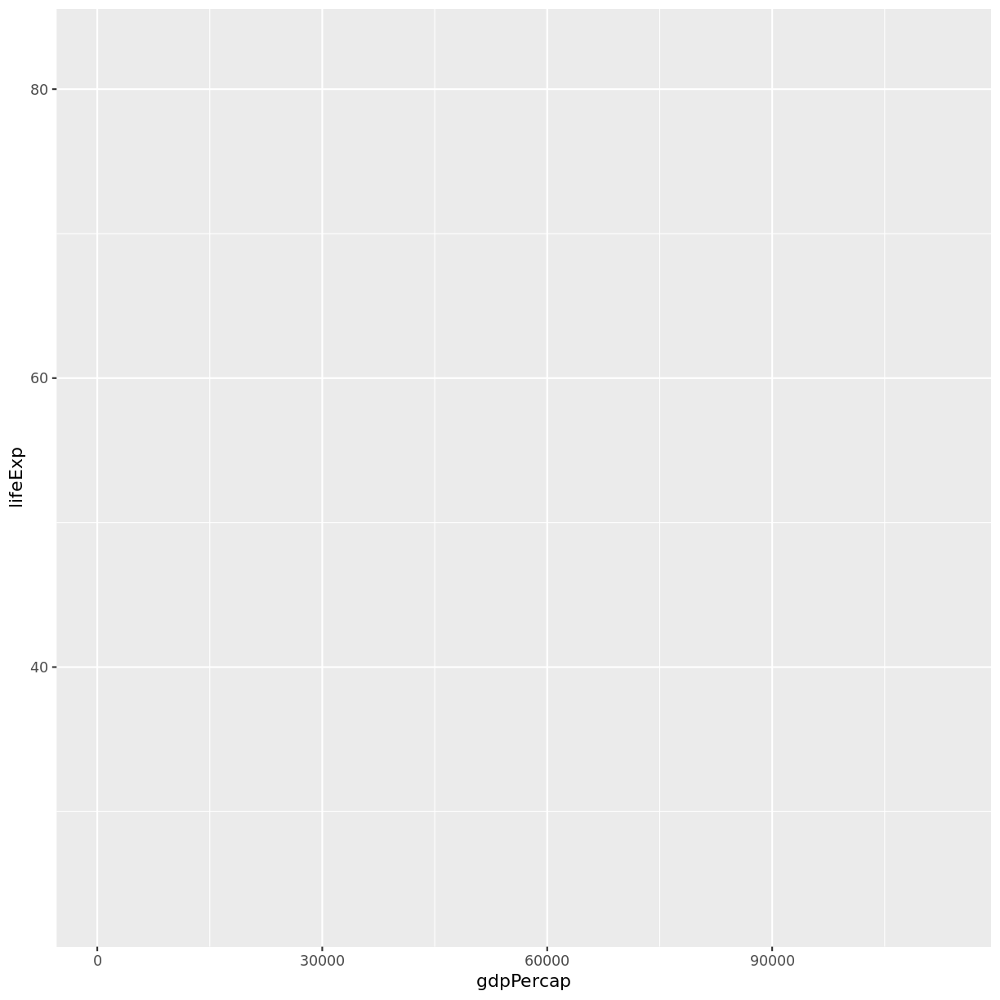
> > or by setting the points to be black:
> > 
> > ~~~
> > ggplot(data = gapminder, aes(x = year, y = lifeExp, group = country, colour = continent)) +
> >   geom_line() + 
> >   geom_point(colour = "black")
> > ~~~
> > {: .language-r}
> > 
> > 
> >
> > Swapping their order changes the order they are drawn on the plot so that now the points are 
> > *under* the lines.
> > 
> > ~~~
> > ggplot(data = gapminder, aes(x = year, y = lifeExp, group = country, colour = continent)) +
> >   geom_point(colour = "black") +
> >   geom_line()
> > ~~~
> > {: .language-r}
> > 
> > 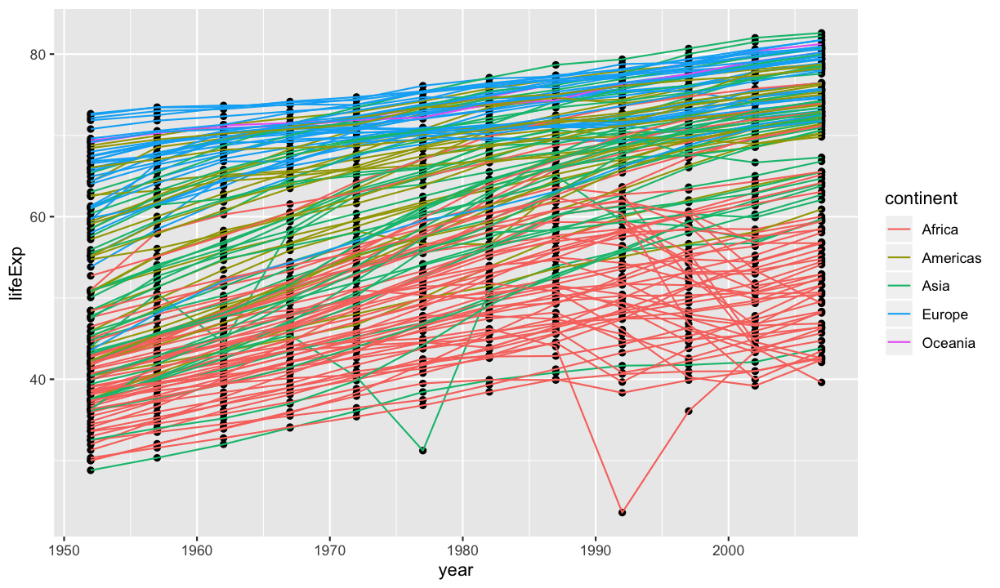
> {:.solution}
{:.challenge}

#### Other geoms?
There are a wide array of geoms that you can add to your plots beyond the points and lines we have
shown so far. The [`ggplot2` cheatsheet](https://www.rstudio.com/resources/cheatsheets/#ggplot2) 
provides examples of different geoms available, as well as descriptions of the characteristics of 
the data that is appropriate for each.

## Transformations and statistics

`ggplot2` also makes it easy to overlay statistical models over the data. To
demonstrate we'll look at the relationship between life expectancy and GDP across the entire
gapminder dataset:

~~~
ggplot(data = gapminder, mapping = aes(x = gdpPercap, y = lifeExp)) +
  geom_point()
~~~
{: .language-r}

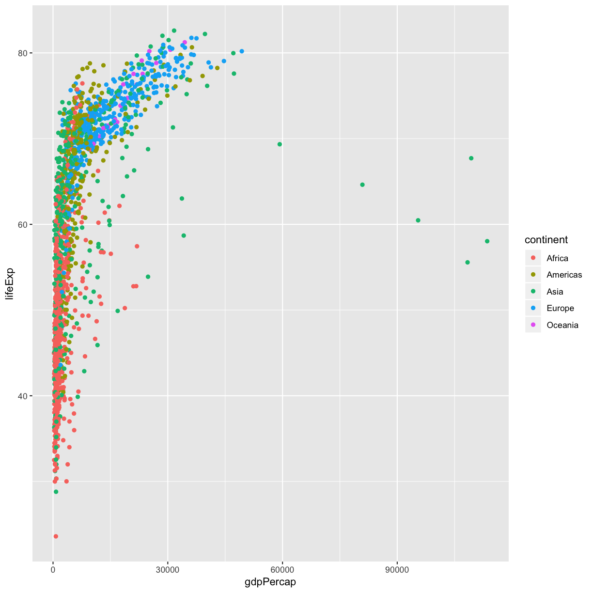

Currently it's hard to see the relationship between the points due to some strong
outliers in GDP per capita. We have seen how we can change the scale of units on the x axis using
the *scale* functions. These control the mapping between the data values and
visual values of an aesthetic. We can also modify the transparency of the
points, using the *alpha* function, which is especially helpful when you have
a large amount of data which is very clustered.

~~~
ggplot(data = gapminder, aes(x = gdpPercap, y = lifeExp)) +
  geom_point(alpha = 0.5) + 
  scale_x_log10()
~~~
{: .language-r}

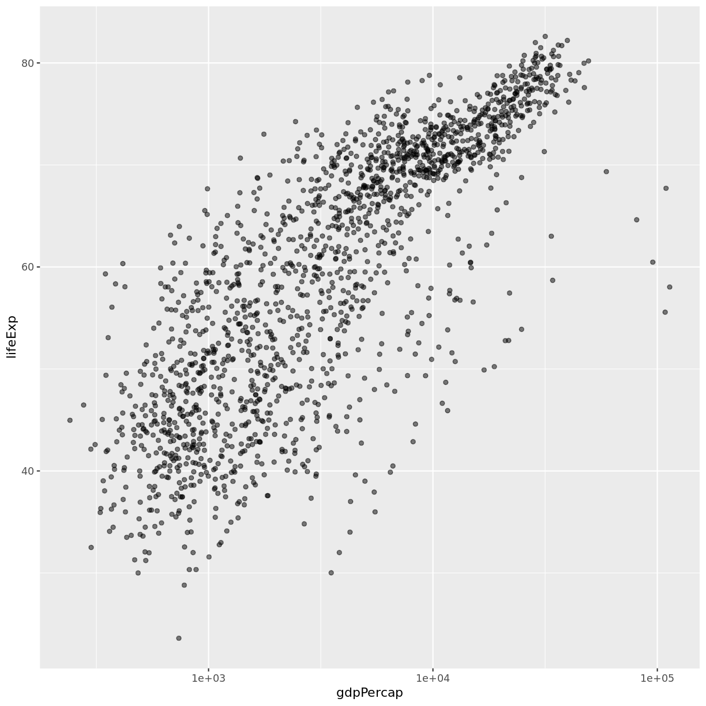

The `log10` function applied a transformation to the values of the gdpPercap
column before rendering them on the plot, so that each multiple of 10 now only
corresponds to an increase in 1 on the transformed scale, e.g. a GDP per capita
of 1,000 is now 3 on the y axis, a value of 10,000 corresponds to 4 on the y
axis and so on. This makes it easier to visualize the spread of data on the
x-axis.

> ## Tip Reminder: Setting an aesthetic to a value instead of a mapping
>
> Notice that we used `geom_point(alpha = 0.5)`. Setting an aesthetic outside of the `aes()` function will cause this value to be used for all points, which is what we want in this case. But just like any other aesthetic setting, *alpha* can also be mapped to a variable in the data. For example, we can give a different transparency to each continent with `geom_point(aes(alpha = continent))`.
{: .callout}

We can fit a simple relationship to the data by adding another layer,
`geom_smooth`:

~~~
ggplot(data = gapminder, aes(x = gdpPercap, y = lifeExp)) +
  geom_point() + 
  scale_x_log10() + 
  geom_smooth(method = "lm")
~~~
{: .language-r}

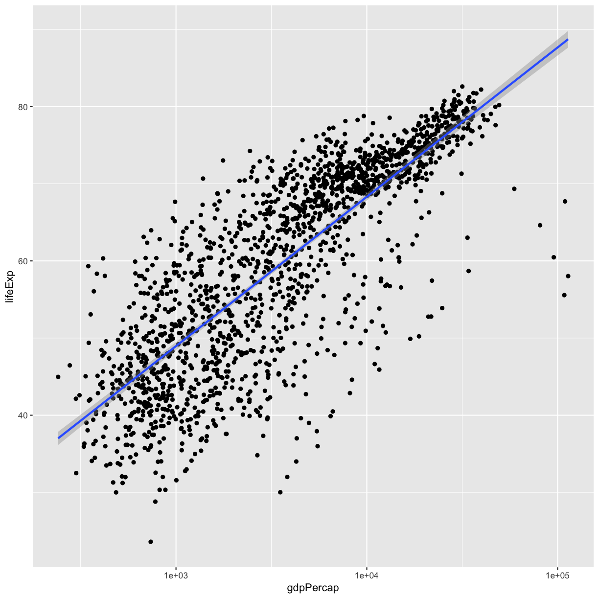

We can make the line thicker by *setting* the **size** aesthetic in the
`geom_smooth` layer. Remember that setting an aesthetic is done outside the `aes()` function:

~~~
ggplot(data = gapminder, aes(x = gdpPercap, y = lifeExp)) +
  geom_point() + 
  scale_x_log10() + 
  geom_smooth(method = "lm", size = 1.5)
~~~
{: .language-r}

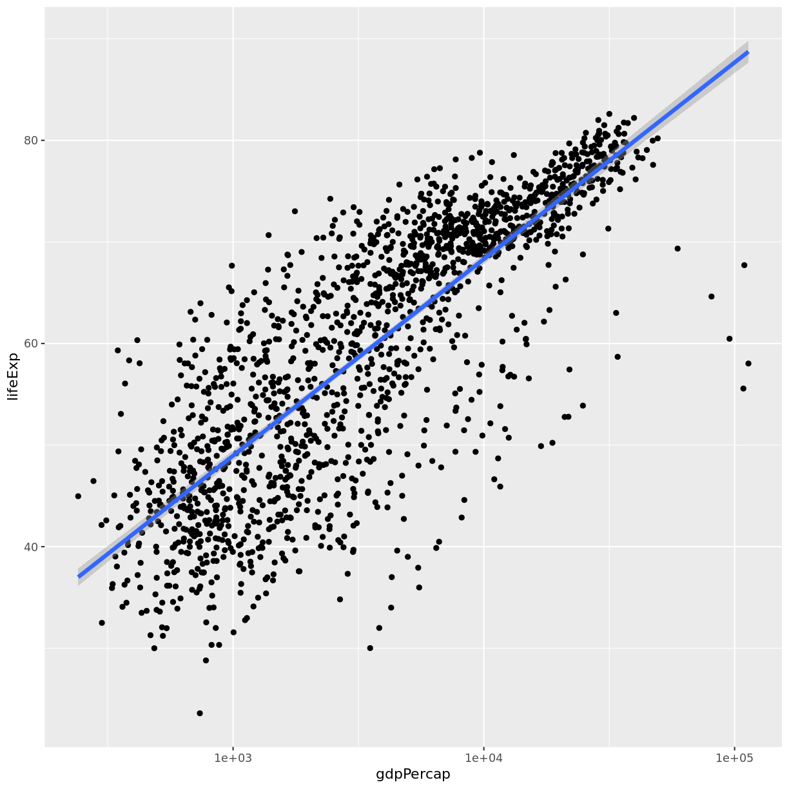

> ## Challenge 9
>
> Modify the color and size of the points on the point layer in the previous
> example.
>
> Hint: do not use the `aes` function.
>
> > ## Solution
> >
> > 
> > ~~~
> > ggplot(data = gapminder, aes(x = gdpPercap, y = lifeExp)) +
> >  geom_point(size=3, color="orange") + 
> >  scale_x_log10() +
> >  geom_smooth(method = "lm", size = 1.5)
> > ~~~
> > {: .language-r}
> > 
> > 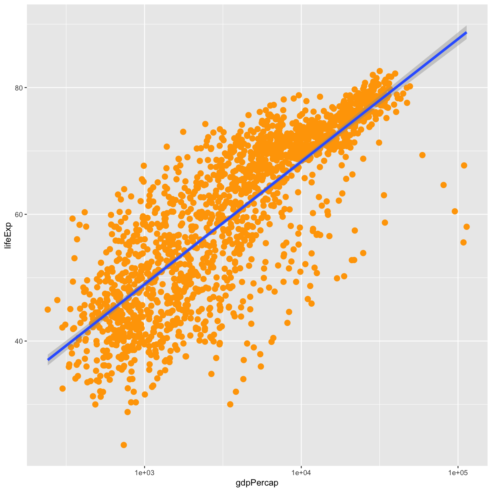
> {: .solution}
{: .challenge}

> ## Challenge 10
>
> Modify your solution to Challenge 9 so that the
> points are now a different shape and are colored by continent with new
> trendlines.  Hint: The color argument can be used inside the aesthetic.
>
> > ## Solution
> >
> >~~~
> > ggplot(data = gapminder, aes(x = gdpPercap, y = lifeExp, color = continent)) +
> >   geom_point(size=3, shape=17) + 
> >   scale_x_log10() +
> >   geom_smooth(method = "lm", size = 1.5)
> >~~~
> >{: .language-r}
> >
> >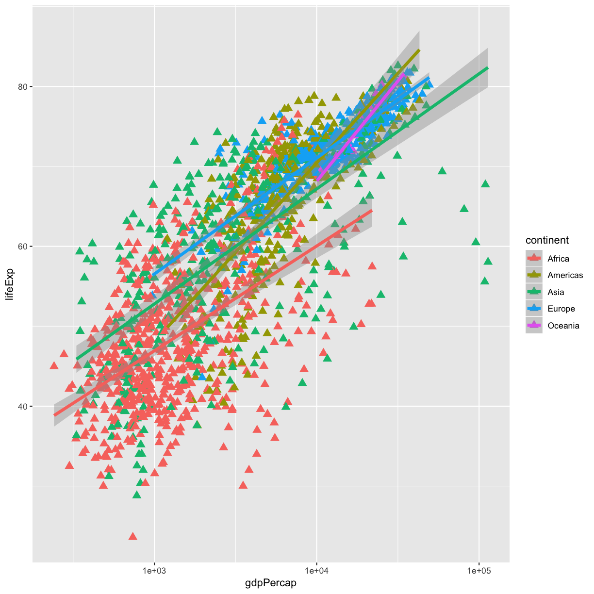
> {: .solution}
{: .challenge}

Scales don't just apply to axes however. For example, we can take control of the colours used for the
colour scale by using `scale_colour_manual()`. This layer takes a `values` argument that lets us
specify the colours that the data values can be mapped to.

~~~
ggplot(data = gapminder, aes(x = gdpPercap, y = lifeExp, color = continent)) +
   geom_point() + 
   scale_x_log10() +
   scale_colour_manual(values = c("red", "green", "blue", "purple", "black"))
~~~
{: .language-r}

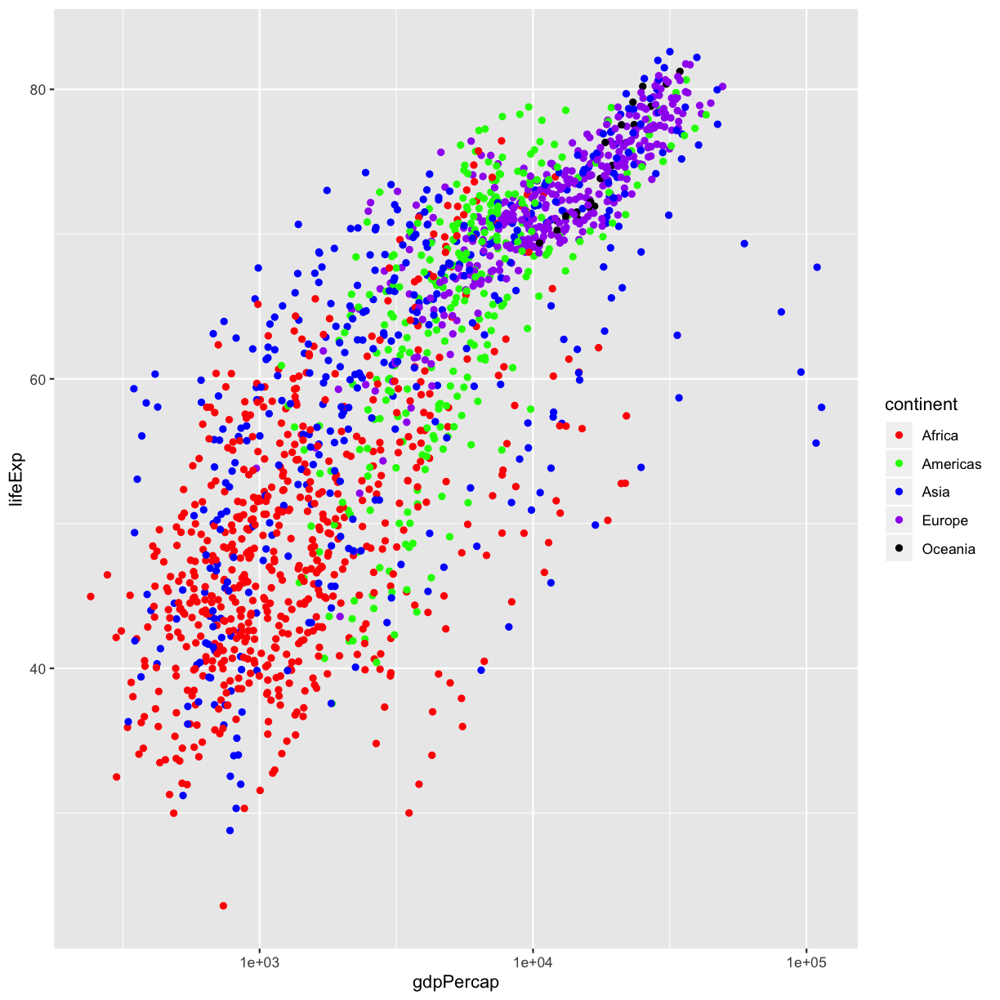

> ## Challenge 11
>
> Try modifying the plot above by changing some colours in the scale to see if you can find a 
> pleasing combination. Run the `colours()` function if you want to see a list of colour names 
> R can use.
>
> There is also a `scale_colour_brewer()` scale that takes an argument `palette` that is the name of 
> a [ColorBrewer](http://colorbrewer2.org) palette. Select an appropriate colour palette for the 
> continents from ColorBrewer and apply it to your plot instead.
> > ## Solution
> > We will select the "Set1" palette for qualitative data.
> >
> >~~~
> > ggplot(data = gapminder, aes(x = gdpPercap, y = lifeExp, color = continent)) +
> >   geom_point() + 
> >   scale_x_log10() +
> >   scale_color_brewer(palette = "Set1")
> >~~~
> >{: .language-r}
> >
> >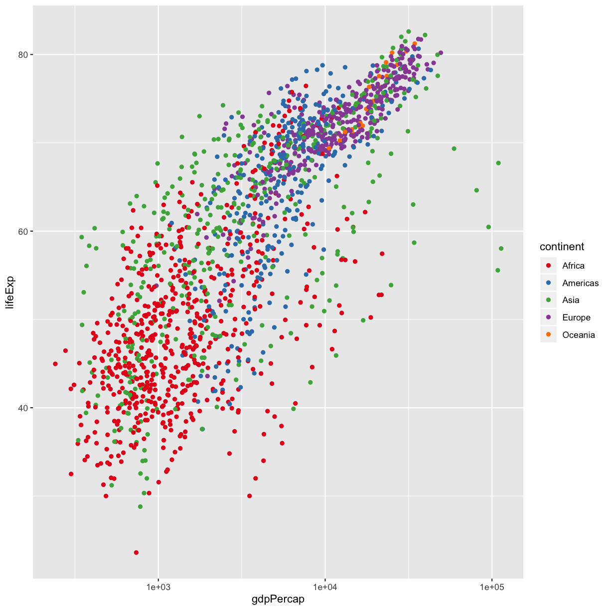
> {: .solution}
{: .challenge}

## Multi-panel figures

Earlier we visualised the change in life expectancy over time across all
countries in one plot. Alternatively, we can split this out over multiple panels
by adding a layer of **facet** panels. To keep a manageable number, we will focus only on those
countries with names that start with the letter "A".

> ## Tip
>
> We start by subsetting the data.  We use the `filter` function from the `dplyr` package and the
> `str_starts()` function to filter only countries with names that start with "A".
{: .callout}

~~~
a_countries <- filter(gapminder, str_starts(country, "A"))

ggplot(data = a_countries, aes(x = year, y = lifeExp, color = continent)) +
  geom_line() + 
  facet_wrap( ~ country)
~~~
{: .language-r}

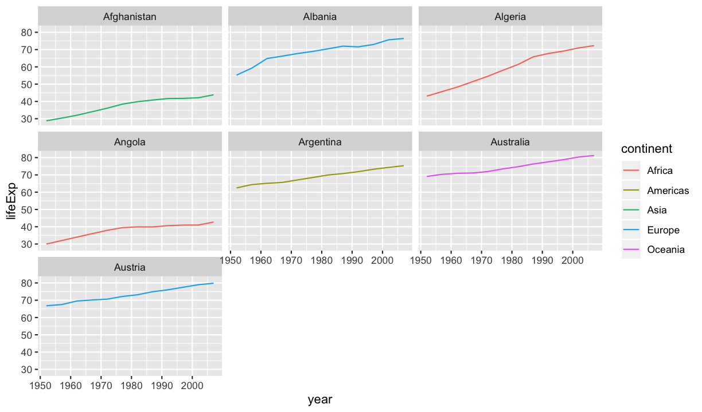

The `facet_wrap` layer took a "formula" as its argument, denoted by the tilde
(~). This tells R to draw a panel for each unique value in the country column
of the gapminder dataset. Each individual panel still has the same aesthetics/scale/geometries etc. 
as each other. 

> ## Challenge 12
> When discussing the gapminder video, we decided to ignore the animation component. Facets provide 
> an option for achieving a similar effect in a static image.
> Take our original plot:
> ~~~~~~~
> ggplot(
>   data = gapminder_1977, 
>   mapping = aes(x = gdpPercap, y = lifeExp, colour = continent, size = pop)
> ) +
>   geom_point() +
>   scale_x_log10()
> ~~~~~~~
> {:.language-r}
> and modify it by
> - using the full `gapminder` dataset
> - adding a `facet_wrap` to demonstrate the change through time
>
> > ## Solution
> > In this case, we want a separate panel per year, so we need to provide the `year` as the faceting
> > variable.
> >
> >~~~
> > ggplot(
> >   data = gapminder, 
> >   mapping = aes(x = gdpPercap, y = lifeExp, colour = continent, size = pop)
> > ) +
> >   geom_point() +
> >   scale_x_log10() +
> >   facet_wrap( ~ year)
> >~~~
> >{: .language-r}
> >
> >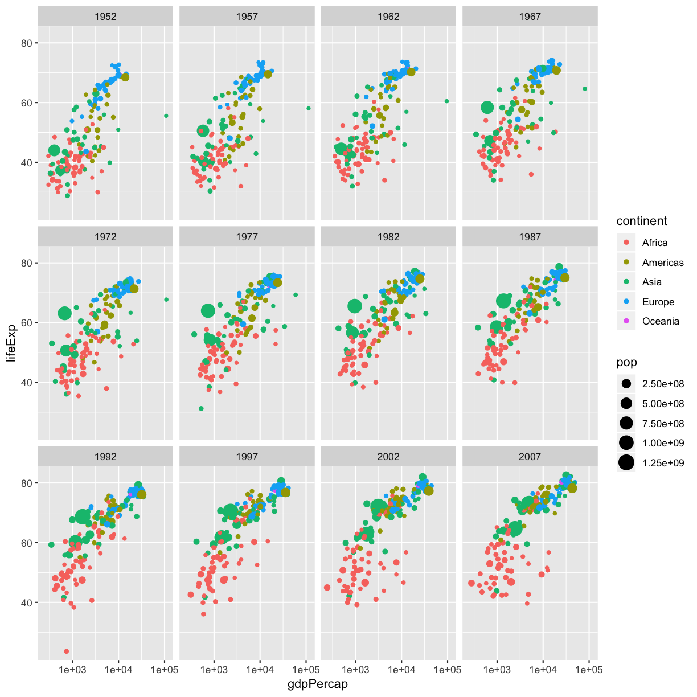
>{:.solution}
{:.challenge}

Our generic structure of a plot construction has been expanded somewhat, but the overall picture should feel familiar:

~~~~~~
ggplot(<DATA>, <AESTHETIC MAPPING>) + 
    <GEOMETRY FUNCTION> +
    <GEOMETRY FUNCTION> +
    <SCALE FUNCTION> +
    <FACET FUNCTION> +
    ...
~~~~~~
{:.language-r}

The core approach of mapping data variables to aesthetic properties and applying those to geometries
remains the same. But we have now seen how that process can be influenced by adding additional layers
that modify the scales or add facets to a figure.

By combining these elements together you can start to build complex plots out of a number of small
building blocks.

> ## Challenge 13
>
> Create a density plot of population, filled by continent.
>
> Advanced:
>  - Transform the x axis to better visualise the data spread.
>  - Add a facet layer to panel the density plots by year.
>
> > ## Solution to challenge 13
> >
> > 
> > ~~~
> > ggplot(data = gapminder, aes(x = pop, fill=continent)) +
> >  geom_density(alpha=0.6) + 
> >  facet_wrap( ~ year) + 
> >  scale_x_log10()
> > ~~~
> > {: .language-r}
> > 
> > 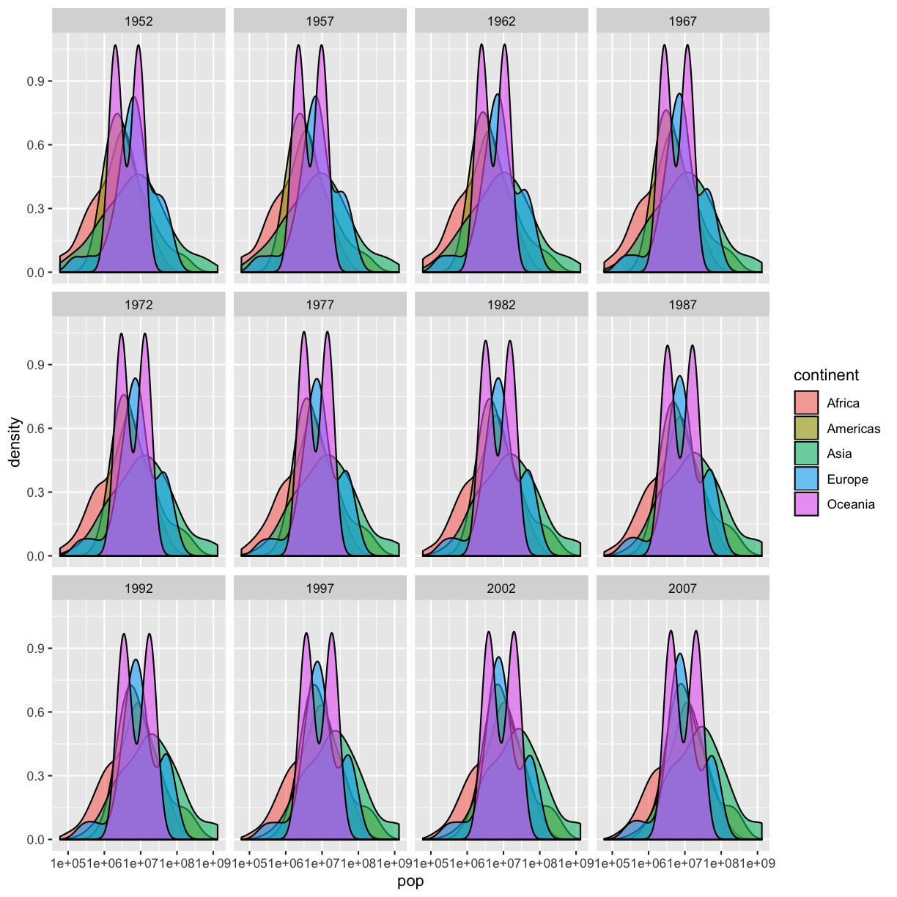
> {: .solution}
{: .challenge}

> ## Challenge 14 - Advanced
>
> Use the `agridat` package to visualise some agricultural data.
>
> Explore the `blackman.wheat` dataset from `agridat`. Generate a plot that shows the effect of fertiliser treatment across genotypes (`gen`) and sites (`loc`).
{: .challenge}
