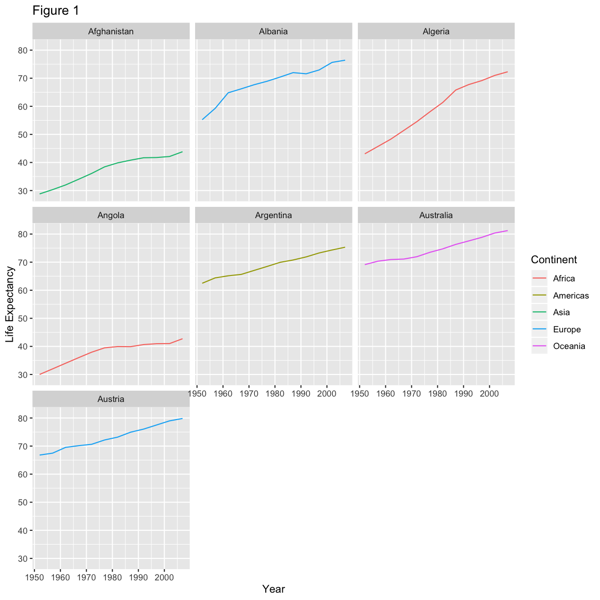
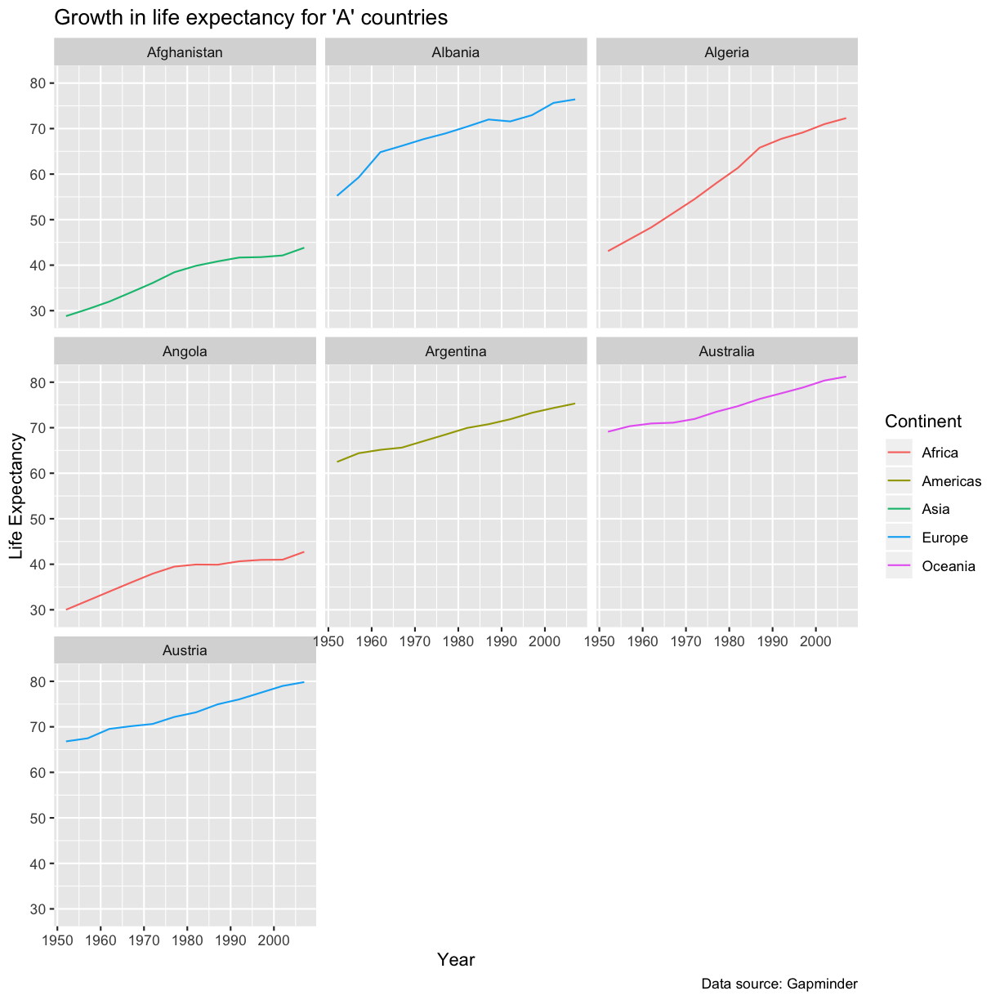
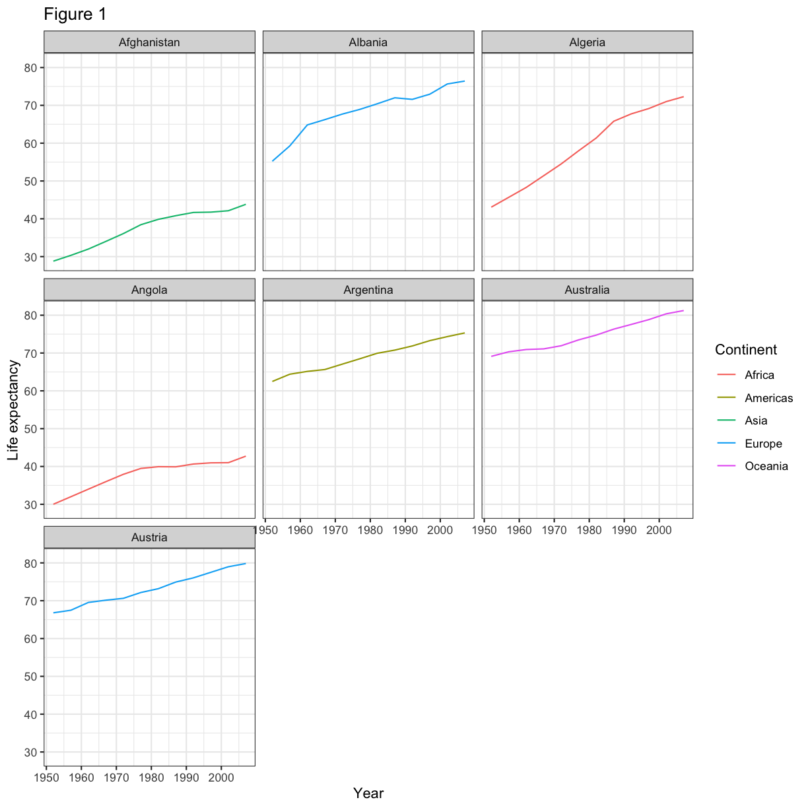
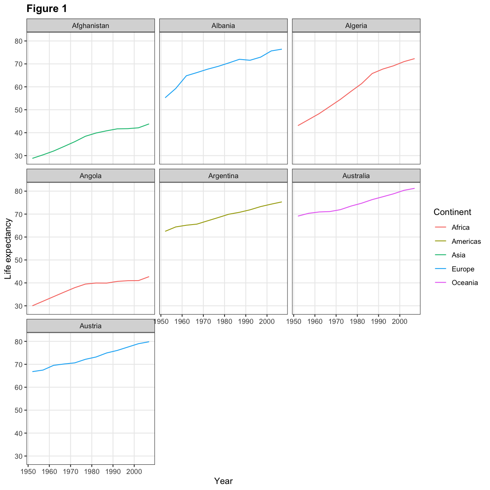
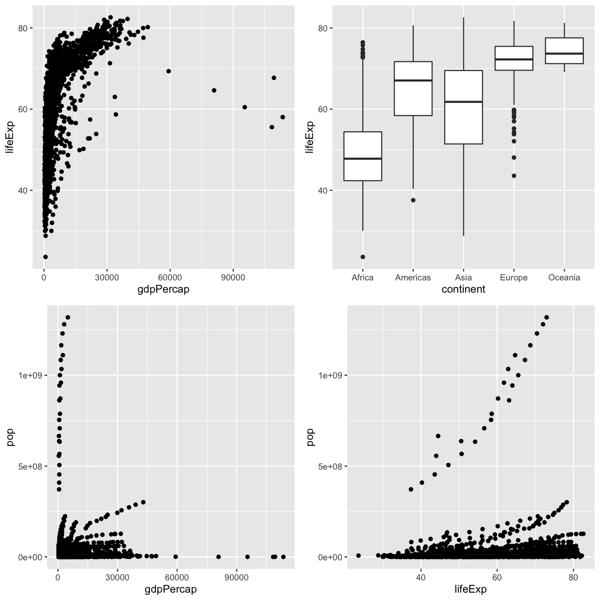
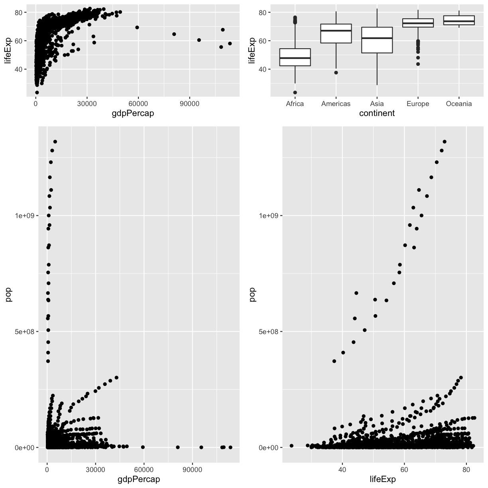
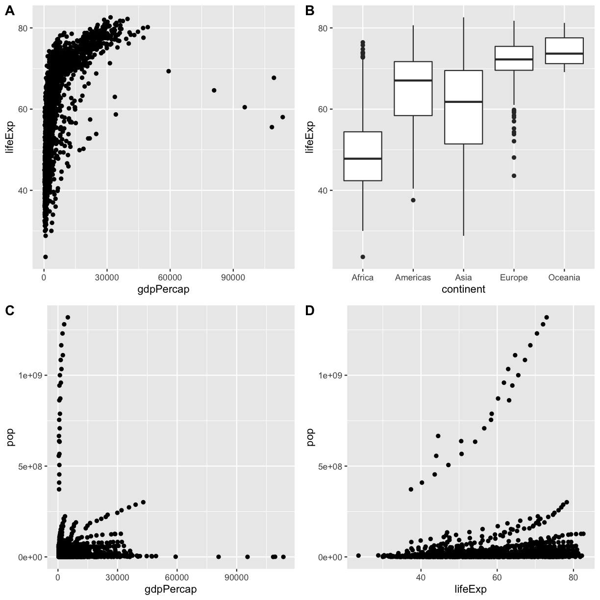

---
# Please do not edit this file directly; it is auto generated.
# Instead, please edit 04-theming.md in _episodes_rmd/
title: Preparing plots for display
teaching: 40
exercises: 90
questions:
- "How can I make my graphics effective?"
objectives:
- "To be able to use modify my plots to make them more understandable"
- "To change the looks of a plot."
- "To combine multiple plots together in a figure"
- "To save plots to a file for use elsewhere."
keypoints:
- "Make sure your plots have useful titles, labels and legends"
- "Use `theme()` to modify how your plot looks"
- "The `cowplot` package lets you create a multi-plot figure"
- "Use `ggsave()` to save a plot to a file"
source: Rmd
---

Going back to our two roles a data visualisation might play:

* As a discovery tool, to explore a dataset
* As a storytelling tool, to highlight features of a dataset

The plots we have been producing so far are suitable for the first point, but are lacking the ability
to be effective communication tools. To create visualisations that are ready to be displayed to others,
whether in a publication or other form, we need to consider the non-data elements of our plots and
make sure they contribute to our message.

We will continue working with our previous plot looking at the change in life expectancy over time
for countries beginning with the letter "A":

~~~
rough_plot <- ggplot(data = a_countries, aes(x = year, y = lifeExp, color = continent)) +
  geom_line() + 
  facet_wrap( ~ country)
~~~
{: .language-r}

> ## Storing plots
> You will see that we have stored the plot above into a variable named `rough_plot`. We can continue
> adding layers to this variable and they will be applied to the plot as usual. Saving a plot into a
> variable can be useful to save typing if you have a basic structure that you want to test adding
> different layers to.
{:.callout}

## Modifying text

To clean this figure up for a publication we need to make it a little more presentable. One of the 
first things we will do is clean up some of the labels for the different aesthetics. Currently, these
are taken directly from the column names in the `gapminder` data frame; `year`, `lifeExp`, `continent`.
This is fine when we are creating rough drafts to explore the dataset, but `Year`, `Life Expectancy`,
and `Continent` would be more appropriate for a final figure.

We can do this by adding a new layer with the `labs()` function. Legend titles
are set using the same names we used in the `aes` specification. Thus below
the color legend title is set using `color = "Continent"`, while the title 
of a fill legend would be set using `fill = "MyTitle"`. 

Within the `labs()` function we can also give the plot a title, subtitle, or caption to help explain
what the plot is showing.

~~~
rough_plot +
  labs(
    title = "Figure 1",      # main title of figure
    x = "Year",              # x axis title
    y = "Life Expectancy",   # y axis title
    color = "Continent"      # title of legend
  ) 
~~~
{: .language-r}

> ## Challenge 1
> "Figure 1" is not a very useful title. 
> - Modify the code above so that the title is more descriptive
> - Let's also make sure we acknowledge our sources. Add a caption reading "Data source: Gapminder"
>
> > ## Solution
> > 
> > ~~~
> > rough_plot +
> >   labs(
> >     title = "Growth in life expectancy for 'A' countries",
> >     caption = "Data source: Gapminder",
> >     x = "Year",              
> >     y = "Life Expectancy",  
> >     color = "Continent"      
> >   ) 
> > ~~~
> > {: .language-r}
> > 
> > 
>{:.solution}
{:.challenge}

## Modifying looks

We might also want to alter the **theme** of our plot to fit the visual style we are aiming for. The 
default theme that has been applied to our plots so far is `theme_grey()`, but there are a number of 
other complete themes inbuilt that you can use. For a more traditional look for publication, you may wish
to try `theme_bw()`, `theme_linedraw()`, or `theme_minimal()`.

~~~
rough_plot +
  labs(
    title = "Figure 1",
    x = "Year",              
    y = "Life expectancy",   
    color = "Continent"     
  ) +
  theme_bw()
~~~
{: .language-r}

We can modify individual elements of the theme of the plot using the `theme()` function. There are
a **lot** of theme elements you can modify (see the [function reference](https://ggplot2.tidyverse.org/reference/theme.html) 
for a full list and examples of how to use them). For our plot, we may decide that we wish to make
the fontface of the title bold and remove the minor gridlines from the axes.

~~~
  rough_plot +
    labs(
      title = "Figure 1",
      x = "Year",              
      y = "Life expectancy",   
      color = "Continent"     
    ) +
    theme_bw() +
    theme(
      panel.grid.minor = element_blank(),
      plot.title = element_text(face = "bold")
    )
~~~
{: .language-r}

> ## Order matters
> If you intend to modify an inbuilt theme, make sure to do it *after* adding the complete theme to
> the plot. Calling `theme()` and then adding a `theme_bw()` will override your changes with the 
> `theme_bw()` settings.
{:.callout}

In general, you *remove* a theme element by setting it to `element_blank()`. To *change* a theme element,
you provide the appropriate settings in an `element_text()`, `element_line()`, `element_rect()`, etc.
function. For example, to set the size of the axis lines, you would pass 
`axis.line = element_line(size = 2)` to the `theme()` function.

> ## Challenge 2
> What would you pass to the `theme()` function to make the following changes?
> 
> 1) Remove the grey boxes behind the country names (controlled by the `strip.background` parameter). 
>
> 2) Increase the size of the major gridlines (`panel.grid.major`) to 1 (need to use `element_line()`)  
>
> 3) Change the axis titles to be shrunk to size 10 and coloured blue
>
> 4) Position the legend at the bottom of the plot.
>
> > ## Solution
> >
> > 1) `strip.background = element_blank()`
> >
> > 2) `panel.grid.major = element_line(size = 1)`
> >
> > 3) `axis.title = element_text(size = 10, colour = "blue")`
> >
> > 4) `legend.position = "bottom"`
>{:.solution}
{:.challenge}

## Exporting the plot

The `ggsave()` function allows you to export a plot created with ggplot. You can specify the dimension and resolution of your plot by adjusting the appropriate arguments (`width`, `height` and `dpi`) to create high quality graphics for publication. In order to save the plot from above, we first assign it to a variable `lifeExp_plot`, then tell `ggsave` to save that plot in `png` format to a directory called `results`. (Make sure you have a `results/` folder in your working directory.)

~~~
lifeExp_plot <- rough_plot +
  labs(
    title = "Figure 1",
    x = "Year",              
    y = "Life expectancy",   
    color = "Continent"     
  ) +
  theme_bw() +
  theme(
    panel.grid.minor = element_blank(),
    plot.title = element_text(face = "bold")
  )

ggsave(filename = "results/lifeExp.png", plot = lifeExp_plot, width = 12, height = 10, dpi = 300, units = "cm")
~~~
{: .language-r}

There are two nice things about `ggsave`. First, it defaults to the last plot, so if you omit the `plot` argument it will automatically save the last plot you created with `ggplot`. Secondly, it tries to determine the format you want to save your plot in from the file extension you provide for the filename (for example `.png` or `.pdf`). If you need to, you can specify the format explicitly in the `device` argument.

## Multi-panel figures

Sometimes, one plot cannot tell the whole story and you need to combine multiple plots into a single
figure. There are several ways you can perform this, but today we will be using the `cowplot` [package](https://github.com/wilkelab/cowplot)

> ## Installing `cowplot`
> `cowplot` is not part of the tidyverse, and so you will need to install it separately if you 
> want to make multi-panel figures. Install `cowplot` by running the following code **once** on your
> computer:
> ~~~~~~~
> install.packages("cowplot")
> ~~~~~~~
> {: .language-r}
> And remember that you will need to load it with `library()` **each time** you wish to use it in a
> script:
> ~~~~~~~
> library(cowplot)
> ~~~~~~~
> {: .language-r}
{:.callout}

The `plot_grid()` function from `cowplot` allows you to combine multiple ggplot objects into a 
single figure. Save each individual plot into a variable and provide them all as arguments to
`plot_grid()`:

~~~
library(cowplot)

# Making some plots
plot1 <- ggplot(gapminder, aes(x = gdpPercap, y = lifeExp)) + geom_point()
plot2 <- ggplot(gapminder, aes(x = continent, y = lifeExp)) + geom_boxplot()
plot3 <- ggplot(gapminder, aes(x = gdpPercap, y = pop)) + geom_point()
plot4 <- ggplot(gapminder, aes(x = lifeExp, y = pop)) + geom_point()

# Combining them into one
plot_grid(plot1, plot2, plot3, plot4)
~~~
{: .language-r}

By default, each panel is given the same size. You can adjust this using the `rel_heights` or `rel_widths`
argument. Provide this argument a vector of numbers of relative sizes for the rows (`rel_heights`)
or columns (`rel_widths`) in the final figure.

~~~
plot_grid(plot1, plot2, plot3, plot4, rel_heights = c(1, 3))
~~~
{: .language-r}

The subfigures can be labelled with the `labels` argument. You can either provide the exact labels
or use `"AUTO"` for uppercase letters as labels, and `"auto"` for lowercase letters.

~~~
plot_grid(plot1, plot2, plot3, plot4, labels = "AUTO")
~~~
{: .language-r}

This is a taste of what you can do with ggplot2. RStudio provides a
really useful [cheat sheet][cheat] of the different layers available, and more
extensive documentation is available on the [ggplot2 website][ggplot-doc].
Finally, if you have no idea how to change something, a quick Google search will
usually send you to a relevant question and answer on Stack Overflow with reusable
code to modify!

[cheat]: http://www.rstudio.com/wp-content/uploads/2015/03/ggplot2-cheatsheet.pdf
[ggplot-doc]: https://ggplot2.tidyverse.org/reference/

> ## Challenge 3
> [Tidy Tuesday](https://github.com/rfordatascience/tidytuesday) is a weekly challenge to explore and
> visualise a dataset. [One challenge](https://github.com/rfordatascience/tidytuesday/tree/master/data/2019/2019-03-12)
> was to work with data on board games that was used in an [article at FiveThirtyEight](https://fivethirtyeight.com/features/designing-the-best-board-game-on-the-planet/)
>
> Working in small groups:
> 
> 1) Map out the elements of the three graphs from the article
> 
> 2) Download the data using
> ~~~~~
> board_games <- readr::read_csv("https://raw.githubusercontent.com/rfordatascience/tidytuesday/master/data/2019/2019-03-12/board_games.csv")
> ~~~~~
> {:.language-r}
>
> 3) Inspect the `board_games` data frame to determine which variables are required for each plot
> and if any further data manipulation is required
> 
> 4) Reproduce the plots from the article. (If you want to get really serious, look into the `ggthemes`
> package for `ggthemes::theme_fivethirtyeight()`)
>
> 5) Work individually to produce one new plot from the data. Show this figure to your group and discuss
> how effective it is at communicating a message.
{:.challenge}

> ## Challenge: putting it all together
> We have previously worked with [meterological observations from the BOM](https://csiro-data-school.github.io/r/15-Reproducibility/index.html).
> Let's return to this data and explore it visually.
>
> #### Getting the data
>
> * Reopen your RStudio project working with the BOM meterological data
> **OR**
> * Revisit the [previous exercise](https://csiro-data-school.github.io/r/15-Reproducibility/index.html#challenge-putting-it-all-together)
> for instructions on setting up and getting the data.
>
> #### Question 1
> **For the Perth station (ID 9225), produce three scatter plots showing the relationship between
> the maximum temperature and each other measurement recorded (minimum temperature, rainfall and 
> solar exposure).**
> 
> > ## Hint
> > Make sure your measurement values are all converted to numeric types with `as.numeric()`. They
> > will have been imported as text values as part of the previous challenge.
> > 
> > To work with just the Perth measurements, make sure to `filter()` your dataset.
> > 
> > The only aesthetics you will need to map for this question are `x` and `y`. Then, a `geom_point()`
> > layer will produce a scatterplot of the two mapped values.
> {: .solution}
> 
> #### Question 2
> **Display these four measurements for the Perth station in a single scatter plot by using additional 
> aesthetic mappings.**
> 
> You may need to try a few different data/aesthetic mappings to find one you like.
> > ## Hint
> > The aesthetics that `geom_point()` can use are found in the help page (`?geom_point`) under
> > the **Aesthetics** heading
> {: .solution}
> > ## Hint 2
> > One possible solution is to map the temperature data to the `x`/`y` aesthetics, the rainfall to
> > the `size` aesthetic, and the solar exposure to the `colour` aesthetic.
> {: .solution}
>
> #### Question 3
> **Take the four plots you have produced in Q1 and Q2 and save them as a multi-panel figure.** 
>
> > ## Hint
> > The `ggsave()` function has a `width` and `height` argument to control how large a figure to create.
> > This may be useful if your initial attempt at saving a figure looks too squashed.
> {: .solution}
>
> #### Question 4
> **Using the entire BOM dataset, calculate the average monthly rainfall for each station. Produce
> a lineplot to visualise this data and the state each station is in.**
> 
> > ## Hint
> > For the data manipulation, you will need to use `group_by()` with multiple variables, and then
> > `summarise()` to get the averaged rainfall measurements. Then `join` in a data frame containing
> > the metadata about each station to be able to know which state each station is in.
> > 
> > If your lines in the plot are looking a bit odd, you may need to use the `group` aesthetic to 
> > make sure there is one line per station.
> >
> > There are many ways you could use to integrate the state information -- the `colour` and `linetype`
> > aesthetics, or by using faceting. Which do you find makes for a better plot?
> {: .solution}
>
> #### Question 5
> **Produce a plot of an interesting relationship you have found while exploring the dataset. Describe the
> message your plot is meant to convey to a viewer and the choices you made during the visualisation 
> process to make your visualisation more effective at getting that message across.**
{:.challenge}

