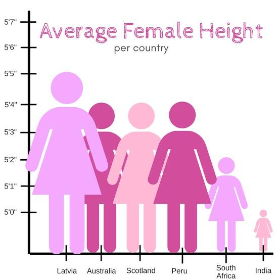

```{r chunk_options, include=FALSE}
source("../bin/chunk-options.R")
knitr_fig_path("02-")
```

```{r setup, include=FALSE}
library(tidyverse)
library(agridat)
library(grid)
library(gridExtra)
library(png)
library(hexbin)
library(patchwork)

data <- read_csv("../data/datasets.csv")
```

By breaking down visualisations with a consistent set of terms, you will hopefully begin to see the
flexibility and freedom of this system. This is the core concept you will need tomorrow as we learn
how to *create* these graphics. If you can describe a plot using the vocabulary and grammar you are
learning, you can create it. Of course, if it is possible to create any plot we can imagine it is 
left up to us to enssure we are creating a **good** one.

There are plenty of guidelines available that suggest ways to create effective visualisations. You 
will likely already have some personal ideas about what makes a good plot.

> ## Discussion
> What features do you think make a visualisation effective?
> 
> Compare answers among several people. Are there any consistent responses or is there a large 
> component of personal opinion?
{:.discussion}

While by no means a comprehensive list, there are a number of things you might want to think about 
when constructing a visualisation of your own. 

## Data mapping

### Avoid mapping a data variable to multiple aesthetics

Think back to the exercise on the 3D bar chart:
{:class="fig-responsive" style="max-width:60%"}

The same variable was mapped to both the z axis and the bar colour, creating a redundancy. This is 
not necessarily a problem, but can usually be avoided without losing any clarity in the plot. Cutting
out the redundancy also frees up a visual property to encode new information if you are looking to
show the relationships between more data.

### Avoid mapping multiple data variables to an aesthetic

Consider the following figure from [Spurious Correlations](https://tylervigen.com/spurious-correlations)

{:class="fig-responsive" style="max-width:100%"}
> ## Challenge
> Draw out the links between data variable and aesthetic mappings in this figure. What is strange
> about this?
> > ## Solution
> > There are two data variables that have both been mapped to the y axis.
> {:.solution}
{:.challenge}

By mapping two variables to the same aesthetic we lose clarity in the plot. It takes time and mental
effort to separate the same visual property back to two potential data sources.

In particular, if your two data sources are not on the same scale it can be very [easy to influence 
the interpretation](https://blog.datawrapper.de/dualaxis/) of the data by changing their scales separately.

### Consider your geometries carefully
One reason why there are so many types of plots is because different geometries can be interpreted
very differently by the human brain, even though they display the same data. Perhaps the best example
of this is bar charts, and the discussions around [whether they should always start at zero](https://flowingdata.com/2015/08/31/bar-chart-baselines-start-at-zero/).

When looking at a bar chart, the *length* of the bar is what determines how people interpret the data.
This differs from an equivalent chart that used points in which the *position* of the point is what
matters. Changing the baseline of a bar chart can drastically alter how the chart gets interpreted:

```{r bar_zero, echo=FALSE, out.width="100%", fig.height=4}
p <- tibble(x = c("A","B"), y = c(90,100)) %>% ggplot(aes(x,y)) + geom_col()

p1 <- p + scale_y_continuous(expand = expand_scale(mult = c(0,0.05)))
p2 <- p + coord_cartesian(ylim = c(80,100))
p3 <- p + coord_cartesian(ylim = c(89, 100))

p1 + p2 + p3
```

This can be seen even more readily when the shape chosen is more easily mapped to a real, physical 
object.

{:class="fig-responsive" style="max-width:60%"}

> ## Discussion
> Are there any other features of this figure that make it an ineffective visualisation?
{:.discussion}

## Colour

### Friends don't let friends use rainbow colour scales

Rainbow colour scales are very, very common in scientific literature. They are a very natural way to represent quantitative data - the wavelength of the colour changes in a linear relationship with the data.

The problem is that our eyes don't perceive those changes in colour in a uniform way.

```{r rainbow, echo=FALSE, fig.height=4}
color.bar <- function(lut, min, max=-min, nticks=11, ticks=seq(min, max, len=nticks), title='') {
    scale = (length(lut)-1)/(max-min)

    dev.new(width=1.75, height=5)
    plot(c(0,10), c(min,max), type='n', bty='n', xaxt='n', xlab='', yaxt='n', ylab='', main=title)
    axis(2, ticks, las=1)
    for (i in 1:(length(lut)-1)) {
     y = (i-1)/scale + min
     rect(0,y,10,y+1/scale, col=lut[i], border=NA)
    }
}

color.bar(rainbow(100), 0, 1)
```

{:class="fig-responsive" style="max-width:60%"}

This can have serious real world consequences for scientific data visualisation.


The plot on the left was published in a [paper in 2006](https://www.atmos-chem-phys.net/6/5183/2006/) using a rainbow colour scale, and reproduced in a sequential colour scale on the right (from [https://www.atmos-chem-phys.net/6/5183/2006/](https://www.atmos-chem-phys.net/6/5183/2006/).

In the versions below, the blue line represent a false boundary that was identified in the data, entirely due to the way our eyes perceive colour - it isn't actually present in the data!


It's not just continuous rainbow colour scales that have this problem. Once you start looking for them, you will see them everywhere.

[One of the worst offenders.](http://bom.gov.au/products/IDR403.loop.shtml)

### Other colour considerations

Aside from the evils of rainbow colour scales, it is also important to consider issues such as:
- colour blindness
- reproduction of figures in monotone (black and white)
- using too many colours for them to be distinguished from each other

An excellent resource for many considerations to do with colour in visualisation is [ColorBrewer](http://colorbrewer2.org/), which provides a range of scales for different applications.

> ## Challenge
> Explore [ColorBrewer](http://colorbrewer2.org/) to understand how it can be used to choose colour
> palettes. If you had four categories in your data to be represented by colour, how many palettes
> can you find that are colourblind friendly for each of the sequential, diverging, and qualitative
> palettes?
>
> > ## Solution
> > Sequential: 18
> >
> > Diverging: 6
> >
> > Qualitative: 1
> {:.solution}
{:.challenge}

## Ink to information ratio

Compare the amount of ink used with the amount of information communicated. A high ink:information can indicate a plot that hasn't been thought through, and is often distracting or confusing. This is a 
good prism to evaluate your plots and assess the inclusion of each component. Everything in a plot
should be there for a reason.

These plots often contain 'chart junk' (Edward Tufte). 
  

> ## Challenge 
> 
> Compare the above figure. 
> - Which elements are removed in the second version?
> - Which elements could still be removed? What is their purpose?
{: .challenge}

## Show as much raw data as possible

By putting your raw data into a figure, it becomes easier to see the true patterns in the data. 
Remember with the datasaurus dozen dataset where summary statistics obscured the true meaning in the
data.

```{r show_raw, echo = F, out.width="100%", fig.height=4}
base_p <- data %>% mutate(dataset = as.factor(dataset)) %>% ggplot(aes(x=dataset, y = y))

p1 <- base_p + stat_summary(fun.data = mean_cl_normal, colour = "red") + labs(title = "Mean and confidence interval", subtitle = "Two summary measurements") + scale_y_continuous(limits = c(0,100))

p2 <- base_p + geom_boxplot(aes(group = dataset))  + labs(title = "Boxplot", subtitle = "Five summary measurements")

p3 <- base_p + geom_jitter(alpha = 0.3, width = 0.3)  + labs(title = "Raw data")

p1 + p2 + p3
```

> ## Discussion
> How do your interpretations of the data change in the above plots as you move closer towards the raw data?
{:.discussion}

### Overplotting

As a result of the suggestion to show your raw data, you will quickly run into the problem of **overplotting** when there are too many data points...

```{r echo=FALSE, out.width="70%"}
ggplot(diamonds, aes(carat, price)) +
  geom_point() +
  scale_y_log10() +
  scale_x_log10()
```
> ## Discussion 
> 
> What are some possible solutions to overplotting?
{: .discussion}

#### Transparency

```{r echo=FALSE, out.width="70%"}
ggplot(diamonds, aes(carat, price)) +
  geom_point(alpha = 0.05) +
  scale_y_log10() +
  scale_x_log10()
```

#### Jittering

```{r echo=FALSE, fig.width=15, out.width="70%"}
p1 <- ggplot(diamonds, aes(cut, price)) +
  geom_point()
p2 <- ggplot(diamonds, aes(cut, price)) +
  geom_point(position = "jitter")
grid.arrange(p1, p2, ncol = 2)
```

#### Binning

By binning and counting the data points you start to step away from displaying the raw data.
But when you have large datasets to show, it may be the best solution.
```{r echo=FALSE, out.width="70%"}
ggplot(diamonds, aes(carat, price)) +
  geom_hex() +
  scale_y_log10() +
  scale_x_log10() +
  scale_fill_viridis_c()
```


Remember that the goal of a visualisation is to explain some feature of a dataset. We want to make 
sure that our figures are clean, clear and easily ingerpretable. If unsure, ask someone with a fresh pair 
of eyes to look over your figure and see if they can explain what is going on.

> ## Challenge
> Go back to your own figure that you described in a previous challenge. Critically examine it for 
> areas that could be improved.
> 
> Ask a partner to look over your figure and tell you what the main message is. 
{:.challenge}
