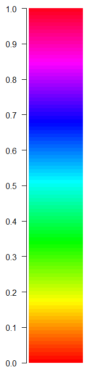

```{r chunk_options, include=FALSE}
source("../bin/chunk-options.R")
knitr_fig_path("02-")
```

```{r setup, include=FALSE}
library(tidyverse)
library(agridat)
library(grid)
library(gridExtra)
library(png)
library(hexbin)
```
## Colour

### Friends don't let friends use rainbow colour scales

Rainbow colour scales are very, very common in scientific literature. They are a very natural way to represent quantitative data - the wavelength of the colour changes in a linear relationship with the data.

The problem is that our eyes don't perceive those changes in colour in a uniform way.

```{r rainbow, echo=FALSE}
color.bar <- function(lut, min, max=-min, nticks=11, ticks=seq(min, max, len=nticks), title='') {
    scale = (length(lut)-1)/(max-min)

    dev.new(width=1.75, height=5)
    plot(c(0,10), c(min,max), type='n', bty='n', xaxt='n', xlab='', yaxt='n', ylab='', main=title)
    axis(2, ticks, las=1)
    for (i in 1:(length(lut)-1)) {
     y = (i-1)/scale + min
     rect(0,y,10,y+1/scale, col=lut[i], border=NA)
    }
}

color.bar(rainbow(100), 0, 1)
```



This can have serious real world consequences for scientific data visualisation.


The plot on the left was published in a [paper in 2006](https://www.atmos-chem-phys.net/6/5183/2006/) using a rainbow colour scale, and reproduced in a sequential colour scale on the right (from [https://www.atmos-chem-phys.net/6/5183/2006/](https://www.atmos-chem-phys.net/6/5183/2006/).

In the versions below, the blue line represent a false boundary that was identified in the data, entirely due to the way our eyes perceive colour - it isn't actually present in the data!


It's not continuous rainbow colour scales that have this problem. Once you start looking for them, you will see them everywhere.

[One of the worst offenders.](http://bom.gov.au/products/IDR403.loop.shtml)

### Other colour considerations

Aside from the evils of rainbow colour scales, it is also important to consider issues such as:
- colour blindness
- reproduction of figures in monotone (black and white)
- using too many colours for them to be distinguished from each other

An excellent resource for many considerations to do with colour in visualisation is [ColorBrewer](http://colorbrewer2.org/), which provides a range of scales for different applications.


## Ink to information ratio

Compare the amount of ink used with the amount of information communicated. A high ink:information can indicate a plot that hasn't been thought through, and is often distracting or confusing. 

These plots often contain 'chart junk' (Edward Tufte).
  

> ## Challenge 
> 
> Compare the above figure. 
> - Which elements are removed in the second version?
> - Which elements could still be removed? What is their purpose?
{: .challenge}

## Some common errors in visualisation
### Overplotting

We're about to learn how to use R to make visualisations. Once you have the ability to quickly turn large datasets into figures, it can be easy to run into the problem of **overplotting** when there are too many data points...

```{r echo=FALSE}
ggplot(diamonds, aes(carat, price)) +
  geom_point() +
  scale_y_log10() +
  scale_x_log10()
```
> ## Discussion 
> 
> - What are some possible solutions to overplotting?
{: .discussion}

### Transparency

```{r echo=FALSE}
ggplot(diamonds, aes(carat, price)) +
  geom_point(alpha = 0.05) +
  scale_y_log10() +
  scale_x_log10()
```

### Binning

```{r echo=FALSE}
ggplot(diamonds, aes(carat, price)) +
  geom_hex() +
  scale_y_log10() +
  scale_x_log10() +
  scale_fill_viridis_c()
```

### Jittering

```{r echo=FALSE, fig.width=15}
p1 <- ggplot(diamonds, aes(cut, price)) +
  geom_point()
p2 <- ggplot(diamonds, aes(cut, price)) +
  geom_point(position = "jitter")
grid.arrange(p1, p2, ncol = 2)

